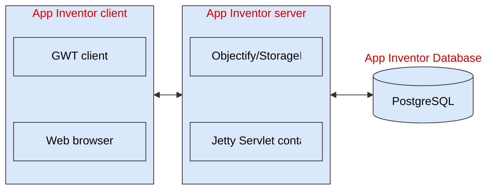

- TOC
  {:toc}

## 1. Introduction

This document provides a high-level overview of the App Inventor source code, including the toolkits and libraries on which App Inventor depends, the different sub-projects within App Inventor, and information flow during the build process and execution.

## 2. Background

MIT App Inventor is a rather large system divided in multiple projects, each of which relies on different open source technologies. Before showing what each of those projects are (section 3), we introduce some of the technologies used within them.

### 2.1 Google Web Toolkit

[Google Web Toolkit](http://code.google.com/webtoolkit/) (GWT) allows programmers to write client-server applications in Java without worrying about the details of remote procedure calls (RPCs) except for providing explicit callbacks for RPCs (one for a successful call, one for failure). GWT compiles the client code into JavaScript, which runs within a web browser, and the RPCs run as Java code on the server, with communication done via HTTP. The reader is advised to learn about GWT before delving into the portion of App Inventor that runs in, or responds to requests from, the user's browser.

Note that the original version of App Inventor used a combination of GWT (client and RPC) and App Engine (as a server), but the App Engine code has been deprecated in favour of a PostgreSQL backed custom server.

### 2.2 Jetty Web Server and PostgreSQL

[Jetty](https://jetty.org/index.html) is an Eclipse project that provides an scalable and efficient web server and servlet container. All the backend logic is hosted by Jetty and backed by a PostgresQL database.

The system still follows the original implementation API for the [Objectify](http://code.google.com/p/objectify-appengine/) datastore, which used to the implementation for StorageIO on App Engine. It has since then evolved outside of App Engine at [Objectify](https://github.com/objectify/objectify). The current App Engine implementation is now [Cloud Storage](https://docs.cloud.google.com/appengine/docs/standard/using-cloud-storage), but it is not used anymore.



_Figure 1: The App Inventor client is created with GWT, which converts the front-end code into JavaScript, which is run with the GWT client library in the user's browser. The back-end runs on the Jetty server as standalone Java service, using the third-party Objectify API for data storage, and using PostgreSQL for storage._

### 2.3 Android and iOS

If you've never written an Android application before and if you're going to work on components, the [Hello, World tutorial](http://developer.android.com/resources/tutorials/hello-world.html) is a good way to get started. If you are serious about writing components, you should also complete the [Managing the Activity lifecycle](https://developer.android.com/guide/components/activities/activity-lifecycle) section.

For iOS the [get started](https://developer.apple.com/ios/get-started/) section in their docs will contain all the information needed.

You don't have to be an expert in both platforms, but you will certainly need the knowledge to use the tools so you can test your ideas in the different platforms before you abstract them as an App Inventor component.

### 2.4 Scheme/Kawa

[Kawa](http://www.gnu.org/software/kawa/) is a free implementation of [Scheme](<http://en.wikipedia.org/wiki/Scheme_(programming_language)>) that compiles to Java byte code, which can be converted by the tool dx into [Dalvik bytecode](<http://en.wikipedia.org/wiki/Dalvik_(software)>). We use Scheme as the internal representation of users' programs, and part of [the runtime library](https://github.com/mit-cml/appinventor-sources/blob/master/appinventor/components-ios/src/runtime.scm) is written in Scheme. These get compiled down to byte code and linked with our components library (written in Java) and external libraries (written in Java and C/C++) by the build server.

### 2.5 Blockly

[Blockly](https://github.com/RaspberryPiFoundation/blockly/) is an open source library created by Googler Neil Fraser, and it's written in TypeScript (using SVG). After a number of years at Google it is now hosted by the RaspberryPiFoundation.

## 3. App Inventor projects and directories

The App Inventor distribution consists of the following subdirectories, the first seven of which contain source code for sub-projects:

- **aiphoneapp**: the interpreter that runs on the mobile device or emulator when it is connected to a computer running App Inventor.
- **aiplayapp**: another version of the interpreter that runs on the mobile device or emulator when it is connected to a computer running App Inventor. This is what we call the MIT App Inventor Companion.
- **appengine**: the GWT application that provides the Designer JavaScript code to the client browser and provides supporting server-side functionality, such as storing and retrieving projects and issuing compile requests to the buildserver.
- **blocklyeditor**: the Blocks Editor, embedded in the browser and powered by Blockly. Used by both blockseditor and buildserver.
- **buildserver**: an http server/servlet that takes a source zip file as input and produces an apk and/or error messages.
- **common**: constants and utility classes used by other sub-projects.
- **components**: code supporting App Inventor components, including annotations, implementations, and scripts for extracting component information needed by other sub-projects. More information can be found in the documents:
  - [How to Add A Component](https://docs.google.com/document/pub?id=1xk9dMfczvjbbwD-wMsr-ffqkTlE3ga0ocCE1KOb2wvw)
  - [How to Add a Property to a Component](https://docs.google.com/document/pub?id=14c1X19s6pXYHdDBOJJELcmOghWbm2FPekRvGzX0ENps)

The remaining two subdirectories contain static files:

- **docs**: user-level documentation, such as tutorials.
- **lib**: external libraries, such as JUnit, used by the various sub-projects. They are listed below in [External Libraries](#5-external-libraries).

Figure 2-A shows where each of the projects' code runs. It is simplified in that it only shows the name of the project (e.g., blocklyeditor) and not specific build targets (e.g., BlocklyCompile). Greater detail can be found in documents on each project (yet to be written) and in the Ant build.xml files in each project's directory. Also note that the build server can be deployed in any cloud service, so any server accessible from the GAE server can be used (including locally in a development machine).


_Figure 2-A: Components of the system and where they run. External infrastructure components are black, parts of App Inventor red._

Figure 3 shows run-time communication among the different sub-projects.


### 3.1 Notes for App Inventor classic

The directory structure changes slightly in the classic version of App Inventor. Instead of a blocklyeditor project, the following two folders exist:

- **blockseditor**: the Blocks Editor, which runs through JNLP on the client.
- **blockslib**: library code (descended from the [MIT Open Blocks library](http://education.mit.edu/openblocks)), used by both blockseditor and buildserver.

There is also a difference in the components figure. App Inventor classic is described as follows:

Figure 2-B shows where each of the projects' code runs. It is simplified in that it only shows the name of the project (e.g., blockslib) and not specific build targets (e.g., OpenBlocks). Greater detail can be found in documents on each project (yet to be written) and in the Ant build.xml files in each project's directory. Also note that although the diagrams depict Amazon EC2 as a potential platform to deploy part of the system, its use is not mandatory. Any server accessible from the GAE server can be used (including locally in a development machine).


_Figure 2-B: Components of the system and where they run. External infrastructure components are black, parts of App Inventor red._

## 4. Component Information Files

Several parts of the system need to know what components exist and their characteristics. This information is generated at build time through a set of annotation processors that run over the components source code and generate files required in order to build the other App Inventor projects. (Here, "project" refers to the parts of the App Inventor codebase, not user-created projects.) These files can be found in the subdirectory `appinventor/build/components`.

### 4.1 simple_components.json

This file is used by the editor within the Designer in the GWT client (part of the appengine project). Here are the keys, their meanings, and sample values for the AccelerometerSensor.

| Key              | Meaning                                                                                                                          | Sample value                                                                     |
| ---------------- | -------------------------------------------------------------------------------------------------------------------------------- | -------------------------------------------------------------------------------- |
| `name`           | the component's name                                                                                                             | `AccelerometerSensor`                                                            |
| `version`        | a number incremented whenever the component's API is changed (such as by adding a new Property)                                  | `1`                                                                              |
| `categoryString` | the section on the palette in which it should appear                                                                             | `SENSORS`                                                                        |
| `helpString`     | descriptive HTML text shown when the user clicks the help icon to the right of the component's name                              | `"<p>Non-visible component that can detect shaking and measure acceleration..."` |
| `showOnPalette`  | whether to show the component on the palette (currently true for all components except for Form, which is automatically created) | `true`                                                                           |
| `nonVisible`     | false for GUI elements, true for non-GUI elements, such as sensors                                                               | `true`                                                                           |
| `iconName`       | a path to the component's icon, relative to `appinventor/appengine/src/com/google/appinventor`                                   | `images/accelerometersensor.png`                                                 |
| `properties`     | a list containing the name, type, and default value of each property                                                             | `[{ "name": "Enabled", "editorType": "boolean", "defaultValue": "True"}]`        |

### 4.2 simple_components.txt

This file, which simply lists component names alphabetically, one per line, is used by the buildserver when building user projects.

### 4.3 simple_components_permissions.json

This file, which is used by the buildserver to generate the permissions required by an app, has entries with the names and required permissions of each component, such as:

```json
{"name": "Clock", "permissions": []},
{"name": "ContactPicker",
 "permissions": ["android.permission.INTERNET",
                 "android.permission.READ_CONTACTS"]}
```

### 4.4 ya_lang_def.xml

This file contains the specification of the blocks used by blockseditor (via blockslib), including both static library functions and components with their methods, properties, and events. Its header and footer come from the static files `OUTPUT_HEADER.txt` and `OUTPUT_FOOTER.txt` in the `src/com/google/appinventor/components/scripts/templates` directory within the components project. At the time of this writing, ya_lang_def was over 14,000 lines. Here is a small excerpt:

```xml
<!-- TinyWebDB Component -->

<BlockGenus name="TinyWebDB" initlabel="TinyWebDB"
            label-unique="yes" editable-label="no" kind="command"
            is-starter="yes" is-terminator="yes" color="grey">
  <description>
    <text>Non-visible component that communicates with a Web service to store and retrieve information.</text>
  </description>
  <LangSpecProperties>
    <LangSpecProperty key="ya-kind" value="component"/>
    <LangSpecProperty key="component-version" value="2"/>
    <LangSpecProperty key="ya-event-1" value="TinyWebDB-GotValue"/>
    <LangSpecProperty key="ya-event-2" value="TinyWebDB-ValueStored"/>
    <LangSpecProperty key="ya-event-3" value="TinyWebDB-WebServiceError"/>
    <LangSpecProperty key="ya-prop-1" value="ServiceURL/read-write-property/text/"/>
    <LangSpecProperty key="ya-method-1" value="TinyWebDB-GetValue"/>
    <LangSpecProperty key="ya-type-method-1" value="Type-TinyWebDB-GetValue"/>
    <LangSpecProperty key="ya-method-2" value="TinyWebDB-StoreValue"/>
    <LangSpecProperty key="ya-type-method-2" value="Type-TinyWebDB-StoreValue"/>
  </LangSpecProperties>
</BlockGenus>
```

### 4.5 component-doc.html

This file, generated by the Ant target `ComponentDocumentation` (which does not appear as a dependency of any other target or task) contains reference documentation in HTML. Descriptions are pulled from annotations or comments in the source code for components. Here is an excerpt:

```html
<h2 id="TinyDB">TinyDB</h2>

<p>Non-visible component that persistently stores values on the phone.</p>

<h3>Properties</h3>
none

<h3>Events</h3>
none

<h3>Methods</h3>
<dl>
  <dt><code>any GetValue(text tag)</code></dt>
  <dd>Retrieve the value stored under the given tag.</dd>
  <dt><code>StoreValue(text tag, any valueToStore)</code></dt>
  <dd>
    Store the given value under the given tag. The storage persists on the phone
    when the app is restarted.
  </dd>
</dl>
```

## 5. External Libraries

A number of external libraries are included in the distribution under the subdirectory `appinventor/lib`. Listed by directory, they are:

- **android**: the [Android SDK](http://developer.android.com/sdk/index.html), used within the components project to generate:
  - AndroidRuntime: the library providing run-time support for the components.
  - libsForAndroidRuntimeTests
  - the annotation processors, which produce the [component information files](#4-component-information-files) described above.
- **animal_sniffer**: [Animal Sniffer](http://mojo.codehaus.org/animal-sniffer/), used within the blockseditor project's BlocksEditorTest to ensure that the Blocks Editor does not contain references to any methods added to the Java standard libraries after Java 5 (1.5). (In the past, we had problems with `String.isEmpty()` sneaking in.) Note that this is for App Inventor classic only.
- **ant-contrib**: [Ant-Contrib](http://ant-contrib.sourceforge.net/), which defines the [propertyregex task](http://ant-contrib.sourceforge.net/tasks/tasks/propertyregex.html) used within the macro `ai.dojunit` in `build-common.xml`.
- **appengine**: the [App Engine Java SDK](http://code.google.com/appengine/downloads.html) required by the appengine project.
- **args4j**: [Args4j](http://java.net/projects/args4j/), a parser for command-line options used for the standalone version of the compiler (which is used to generate StarterApp) within the buildserver project.
- **blockly**: this is the source code for the [Blockly library](https://code.google.com/p/blockly/) in which the blocks editor in App Inventor 2 is based.
- **commons-fileupload**: part of the [Apache Commons](http://commons.apache.org/), providing the ability to upload projects and individual asset files to the UploadServlet within the appengine project.
- **commons-io**: part of the [Apache Commons](http://commons.apache.org/), providing the FileUtils class, which is used in BlockSaveFileTest.java in the blockslib project.
- **findbugs**: [FindBugs](http://findbugs.sourceforge.net/), which is only included for its definition of `javax.annotation.Nullable`, which is [required by the Guava GWT library](http://code.google.com/p/guava-libraries/issues/detail?id=776).
- **gson**: [Gson](http://code.google.com/p/google-gson/), a Java library to convert between JSON and Java objects, required by keyczar (below).
- **guava**: [Guava](http://code.google.com/p/guava-libraries/), a public version of some of the internal Google libraries on which the original version of App Inventor was written.
- **gwt**: [Google Web Toolkit](http://code.google.com/webtoolkit/), used by appengine to create the browser client.
- **gwt_dragdrop**: [gwt-dnd](http://code.google.com/p/gwt-dnd/), a drag-and-drop library for GWT. This is used by appengine as part of the browser client.
- **gwt_incubator**: the deprecated [Google Web Toolkit Incubator](http://code.google.com/p/google-web-toolkit-incubator/). The appengine project uses [GWTCanvas](http://collectionofdemos.appspot.com/javadoc/com/google/gwt/widgetideas/graphics/client/GWTCanvas.html) and [Color](http://collectionofdemos.appspot.com/javadoc/com/google/gwt/widgetideas/graphics/client/Color.html) in the mock component implementation.
- **jdk5**: this includes the API signature file (not library) `jdk5.sig` to be used by animal_sniffer (above) to ensure that the Blocks Editor does not contain references to any methods added to the Java standard libraries after Java 5 (1.5). This was generated by a commented-out target, `BuildJdk5Signature`, in the build.xml file for blockseditor.
- **json**: the reference Java library to parse [JSON](http://www.json.org/). JSON is used throughout the system:
  - to encode the components used and their properties in a user project (`Screen1.scm`).
  - by the Form, GameClient, TinyDB, TinyWebDB, Voting, and Web components.
  - to encode the permissions associated with each component (`simple_components_permissions.json`, described above).
- **junit**: the standard [Java unit testing library (JUnit)](http://www.junit.org/), used for tests throughout the system.
- **junit4**: [test libraries for Java](http://code.google.com/p/test-libraries-for-java/), used on top of JUnit.
- **junit-addons**: [JUnit addons](http://junit-addons.sourceforge.net/), specifically the classes [junitx.framework.Assert](http://junit-addons.sourceforge.net/junitx/framework/Assert.html) and [junitx.framework.ListAssert](http://junit-addons.sourceforge.net/junitx/framework/ListAssert.html).
- **kawa**: the [Kawa language framework](http://www.gnu.org/software/kawa/), whose included compiler is used to convert YAIL/Scheme code to Java byte code.
- **keyczar**: the [Keyczar cryptographic library](http://www.keyczar.org/) used for generating keys for signing Android apps.
- **log4j**: the [log4j logging library](http://logging.apache.org/log4j/) required by keyczar.
- **objectify-3.0**: the [objectify-appengine library](http://code.google.com/p/objectify-appengine/), which provides a simpler interface to the Google App Engine datastore.
- **powermock**: the [PowerMock testing framework](http://code.google.com/p/powermock/), which enables mocking Android classes with final methods.
- **responder-iq**: classes supporting testing from the [responder-iq library](http://code.google.com/p/responder-iq/). Specifically, we use the classes `com.riq.MockHttpServletRequest` and `com.riq.MockHttpServletResponse` in DownloadServletTest.java.
- **tablelayout**: [TableLayout](http://java.sun.com/products/jfc/tsc/articles/tablelayout/), used in blockslib for layout within the Blocks Editor, not to be confused with the Android TableLayout class.
- **twitter**: [Twitter4j](http://twitter4j.org/en/index.html), an unofficial Java library for the Twitter API, used by the Twitter component.

## 6. Programming Style

We generally follow these style guides:

- [Android Code Style Rules](https://source.android.com/source/code-style.html)
- [Sun/Oracle Code Conventions](http://www.oracle.com/technetwork/java/index-135089.html)
- [Javadoc](http://www.oracle.com/technetwork/java/javase/documentation/index-137868.html)

An exception is that we use upper-camel-case (e.g., "MoveTo") for component property, method, and event names.

## 7. Git Branches

The official App Inventor sources reside on GitHub in `mit-cml/appinventor-sources.git`. The primary branches are:

- `master` -- The current sources for MIT App Inventor 2
- `ai1` -- The last version of MIT App Inventor Classic
- `gh-pages` -- This website (GitHub convention for "pages")
- `ucr` -- "Upcoming Component Release"

Periodically there will be other branches for a specified purpose, usually branches representing longer term development, often separately reviewed. Currently there is an "api4" branch where we are working on changes to support a minSdk of 4 (or greater).

There are two types of releases that we make on our public service. The more significant release we refer to as a "Component Release." A Component release includes changes to components such that App Inventor programmers will need to update their version of the App Inventor Companion and we also need to update the buildservers (which package apps for people) to be able to use the new/modified component(s). Because projects are marked with the version of the components they were built with, once we perform a component release WE CANNOT GO BACK!!! It is also worth noting that Component releases require work on the part of App Inventor Programmers because they have to update the AI2 Companion on their devices and or within their copy of the Android Emulator. Because of the effort and testing required, we tend to avoid having too many component releases too close together. In general we have been doing a Component Release once per month.

By comparison "non component releases" are where we do not update components. For example changes to the App Inventor blocks layer, or other features of the Website itself. They can usually be backed out if there is a problem and they do require action on the part of App Inventor programmers.

Because we do not wish to do component releases too often, we do not always want to checking changes to the master branch which contain component changes. Instead we have a new branch named "ucr" where we will be merging component changes that pass review. When it comes time to do a Component Release, we will merge the ucr branch into the master branch prior to the release.

## 8. GitHub and Gerrit Reviews

Changes to MIT App Inventor should be made via the [GitHub Workflow](https://docs.google.com/document/d/1sAw0QObTxTWqRX7GQRCa2z9TIV2r5AKT9UKMFF1acZI/pub). In general we will not use GitHub to merge in changes. Instead after reviewing a change the release coordinators will squash your commits down to a single commit which will either be rebased on the master branch (non component change) or onto the ucr branch (component changes). Often as part of this work we will submit your commit to our private "Gerrit" review server which will arrange for automated running of our unit tests via the "Jenkins" continuous integration system. In general you do not need to be aware of this level of detail. Sometimes internal changes bypass the GitHub workflow and are reviewed directly on Gerrit, though this is happening less often now.
