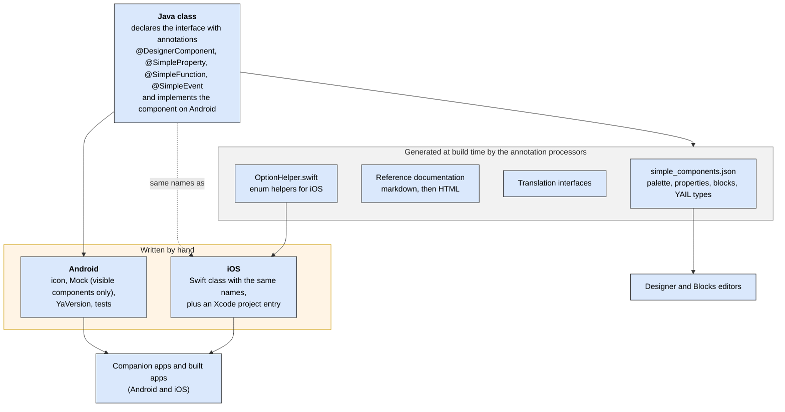
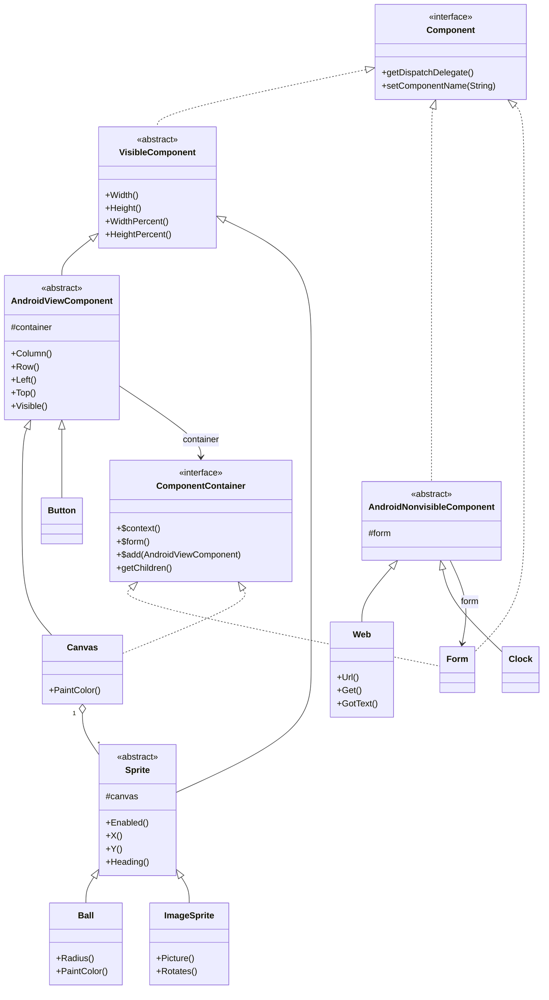
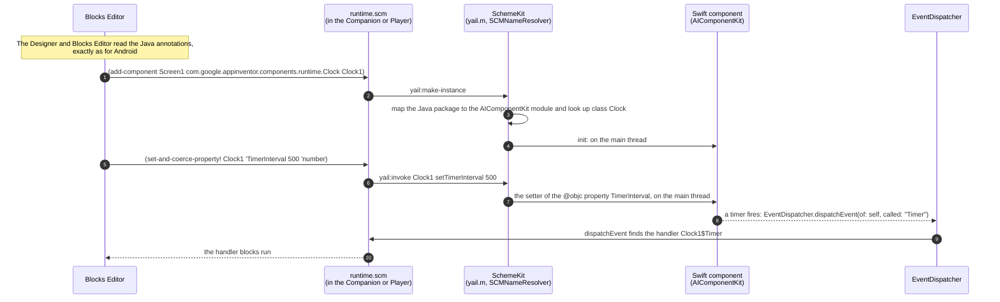
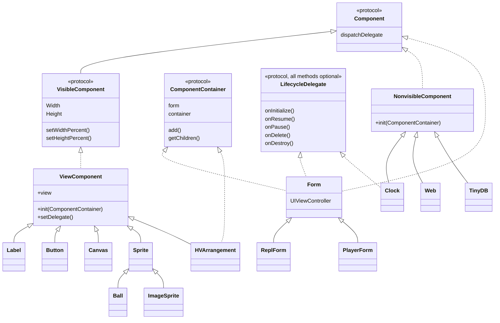
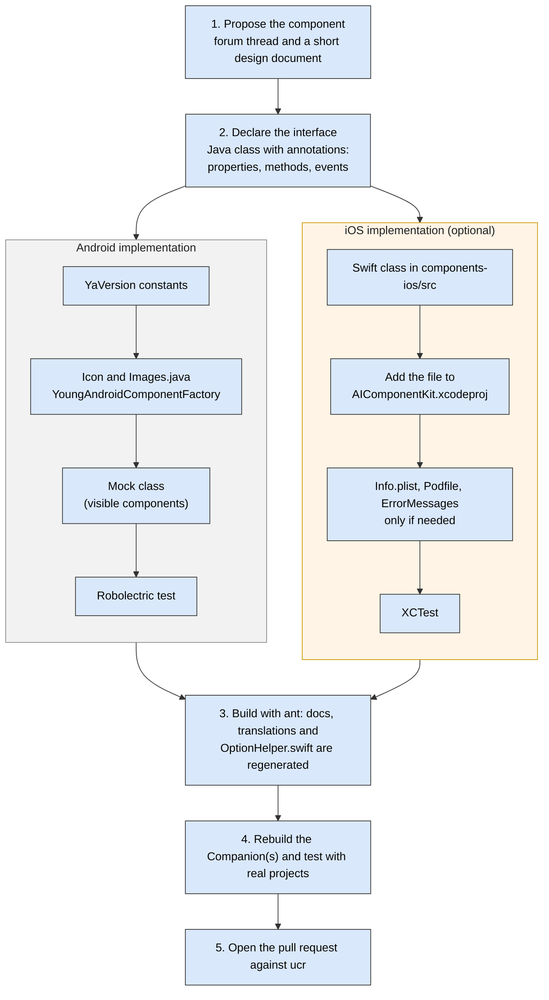

- TOC
{:toc}

This document describes how to design and add a new component to App Inventor, on both **Android** and **iOS**.

Paths in this document are relative to the `appinventor/` directory of the [repository](https://github.com/mit-cml/appinventor-sources) unless they say otherwise. To keep them short, we abbreviate three common prefixes:

- `RT` is `components/src/com/google/appinventor/components/runtime`, the Android runtime classes.
- `C` is `components/src/com/google/appinventor/components`, which also holds the annotations and the annotation processors.
- `AE` is `appengine/src/com/google/appinventor/client`, the Designer (the browser client).

## 1. Background

### 1.1 The platforms

Every component has two parts:

- Its **interface** is its name and its properties, methods and events, with their types. The interface is declared once, with annotations, on a **Java class**. Everything that only needs to know what the component looks like is generated from those annotations: the palette and the properties panel of the Designer, the blocks, the reference documentation and the translations.
- Its **implementation** is the code that makes the component work on a platform. On **Android** it is the same Java class that carries the annotations. On **iOS** it is a separate Swift class (Section 7) that has the same name and the same members, and that the interpreter matches to the interface by name.

The two implementations depend on the shared interface, and not on each other. You can implement the platforms in either order, or in parallel, as long as the interface is agreed. There is one practical constraint: the Designer only offers a component once its annotated Java class exists, so to try a Swift class from the Designer (or to generate the documentation and the Swift enum helpers) you need at least the annotated declaration in Java. Until now components have been implemented on Android first, because that is the older platform, but the tools do not require it.

It is assumed that readers of the Android sections know how to write Android programs using the Java SDK. If you don't, the [Android Developers site](https://developer.android.com/) has good information on [building your first app](https://developer.android.com/training/basics/firstapp) and on [managing the Activity lifecycle](https://developer.android.com/guide/components/activities/activity-lifecycle). Readers of the iOS sections are assumed to know Swift and UIKit. Apple's [get started](https://developer.apple.com/ios/get-started/) pages are the place to start.

You don't have to be an expert in both platforms, but you will need enough knowledge of each to try your idea natively before you abstract it as a component.

One aspect of Android worth highlighting and reading about is [the Android UI thread](https://developer.android.com/guide/components/processes-and-threads), which is responsible for responding to UI interactions (such as button presses) and updating the UI. All user code and most component library code runs in the UI thread. (Later, we discuss creating threads as a result of user actions.) This gives a simple execution model for users: an App Inventor procedure will never be interrupted by an event handler, or vice versa, nor will one event handler be interrupted by another. On iOS the same guarantee is kept by running everything on the main thread and by deferring events (Section 7.6). Figure 1 illustrates the rule.


_Figure 1: A sample program demonstrating serial semantics. When Button1.Click is executed, the two balls are placed in the same position, which adds the event handler Ball1.CollidedWith to the scheduling queue. It is not executed until the first handler has completed, no matter how long the (unshown) user procedure `wait` takes. The final label display is always "...End of Button1.Click......Ball1.CollidedWith..."._

### 1.2 What a component is made of

Figure 2 shows the pieces. The interface is declared once, in the annotations of the Java class. The annotation processors run during the build and generate `simple_components.json`, which drives the palette, the properties panel and the blocks, as well as the reference documentation, the translations and the Swift helper for enums. You then add the platform-specific pieces by hand.



_Figure 2: What goes into a component. The processors are in `C/scripts/`. Nothing reads the Swift code, so an iOS component is never discovered or validated automatically._

### 1.3 The class hierarchy

All components fit within a class/interface hierarchy, a subset of which is shown in Figure 3. All components implement the [Component](https://github.com/mit-cml/appinventor-sources/blob/master/appinventor/components/src/com/google/appinventor/components/runtime/Component.java) interface, which consists mostly of useful constants. Most components extend either [AndroidViewComponent](https://github.com/mit-cml/appinventor-sources/blob/master/appinventor/components/src/com/google/appinventor/components/runtime/AndroidViewComponent.java) (which is a `VisibleComponent`) or [AndroidNonvisibleComponent](https://github.com/mit-cml/appinventor-sources/blob/master/appinventor/components/src/com/google/appinventor/components/runtime/AndroidNonvisibleComponent.java), and some also implement the [ComponentContainer](https://github.com/mit-cml/appinventor-sources/blob/master/appinventor/components/src/com/google/appinventor/components/runtime/ComponentContainer.java) interface. The exceptions are child-only components, such as the chart data components and the map features, which implement `Component` through a sub-interface and live inside a container of a matching type.

Every application has a [Form](https://github.com/mit-cml/appinventor-sources/blob/master/appinventor/components/src/com/google/appinventor/components/runtime/Form.java) (displayed to the user as "Screen"), which holds zero or more `AndroidViewComponent`s, the superclass of most visible components. Exceptions include [Sprite](https://github.com/mit-cml/appinventor-sources/blob/master/appinventor/components/src/com/google/appinventor/components/runtime/Sprite.java) (and its concrete subclasses [Ball](https://github.com/mit-cml/appinventor-sources/blob/master/appinventor/components/src/com/google/appinventor/components/runtime/Ball.java) and [ImageSprite](https://github.com/mit-cml/appinventor-sources/blob/master/appinventor/components/src/com/google/appinventor/components/runtime/ImageSprite.java)), which extend `VisibleComponent` directly and can be contained only in a [Canvas](https://github.com/mit-cml/appinventor-sources/blob/master/appinventor/components/src/com/google/appinventor/components/runtime/Canvas.java).



_Figure 3: An incomplete subset of the Android component class/interface hierarchy. Interfaces and abstract classes are marked. `Form` also implements `HandlesEventDispatching` and extends `AppInventorCompatActivity`, which is an `android.app.Activity`._

Some other base classes you may meet are `TouchComponent` (the base of `ButtonBase`, the pickers and `Spinner`), `TextBoxBase`, `HVArrangement`, `TableArrangement`, `AbsoluteArrangement`, `FileBase` and `MapFeatureContainerBase`. The iOS hierarchy is shown in Section 7.2.

### 1.4 Yail

The intermediate representation for apps during compilation is YAIL (Young Android Intermediate Language, often written "Yail" or "yail", and pronounced "Yale"). YAIL programs consist of [s-expressions](http://en.wikipedia.org/wiki/S-expression) that can be translated by a Scheme compiler or interpreter with the appropriate macros and procedures.

- On **Android** the Kawa Scheme compiler is used, with the macros and procedures defined in [runtime.scm](https://github.com/mit-cml/appinventor-sources/blob/master/appinventor/buildserver/src/com/google/appinventor/buildserver/resources/runtime.scm) in the buildserver.
- On **iOS** the YAIL is interpreted at run time by SchemeKit (`schemekit/`, a fork of picrin), with its own `components-ios/src/runtime.scm`. Section 7.1 explains how it finds your Swift class.

### 1.5 Naming

The names of components and their properties, methods, and events are all capitalized as UpperCamelCase. The Java code style forbids this for ordinary methods, but the checkstyle configuration explicitly allows it for components. Swift components use exactly the same names as the Java ones (Section 7.1 explains why this is required).

### 1.6 Types

Table 1 shows the types in the App Inventor language, their correspondence to Yail compile-time and Scheme run-time types, and the Swift type to declare on iOS. Translation between Java and Yail types occurs in `ComponentProcessor.javaTypeToYailType()` (`C/scripts/ComponentProcessor.java`).

| Java type                                                         | Yail type (compile time)     | Scheme type (run time) | Swift type (iOS)                                       | Sample use                                             |
| ----------------------------------------------------------------- | ---------------------------- | ---------------------- | ------------------------------------------------------ | ------------------------------------------------------ |
| `boolean`                                                         | `boolean`                    | boolean                | `Bool`                                                 | `Button.Enabled`                                       |
| `String`                                                          | `text`                       | string                 | `String`                                               | `Label.Text`                                           |
| `int`, `short`, `long`, `float`, `double`, `byte`                 | `number`                     | number                 | `Int32` (preferred), `Int`, `Int64`, `Float`, `Double` | `Label.FontSize`, `Clock.SystemTime`, `Sprite.Heading` |
| `java.util.Calendar`                                              | `InstantInTime`              | `java.util.Calendar`   | `Date`                                                 | `Clock.Now`                                            |
| `Object`                                                          | `any`                        | any Java type          | `AnyObject`                                            | `TinyDB.StoreValue`                                    |
| `Component` or any class implementing it                          | `component`                  | the component          | `Component`, or the concrete class                     | `Sprite.CollidingWith`                                 |
| `YailList`, `List`                                                | `list`                       | `yail-list`            | `YailList<AnyObject>`, `[AnyObject]`, `[String]`       | `ListPicker.Elements`                                  |
| `YailDictionary`                                                  | `dictionary`                 | `YailDictionary`       | `YailDictionary`                                       | `TinyDB.GetEntries`                                    |
| a class implementing `OptionList` (an enum), used with `@Options` | `<fully.qualified.Type>Enum` | the enum instance      | a class deriving from `NSObject` and `OptionList`      | `Label.TextAlignment`                                  |
| `Continuation<T>`                                                 | `continuation`               | a closure              | not supported yet                                      | `File` (asynchronous methods)                          |

_Table 1: Correspondences between Java, Yail, Scheme and Swift types._ The Yail types `boolean`, `text` and `number` are built-in Scheme types. The run-time types for `InstantInTime`, `any` and `component` are simply their Java types, which are accessible through the Kawa Scheme implementation. The Scheme name `yail-list` refers to the Java type `YailList`, a subclass of the Kawa type `gnu.list.Pair`.

Some rules to remember:

- **Use primitive types, never boxed ones.** A `java.lang.Integer` (or `Boolean`, `Long`, and so on) is rejected by the annotation processor with the error "Found use of boxed type".
- **Prefer `double` to `float` and `int` to `short`.**
- **Use an enum for a fixed set of choices.** Annotate the `int` or `String` parameter or return type with `@Options(YourEnum.class)`, where the enum implements `common.OptionList`. The Blocks Editor then offers a drop-down of helper blocks. There are about 100 uses, for example `@Options(TextAlignment.class) int TextAlignment()` in `Label`.
- **Mark colors with `@IsColor`** on an `int` that holds an alpha-red-green-blue value.
- On iOS, only `Int32`, `Int`, `Int64`, `Float`, `Double`, `Bool`, `String` and object types can be returned to Yail. Returning `UInt32` or `Int16`, for example, fails at run time (Section 7.4).

Global variables are untyped. Static type checking is performed only when the inputs to a block are literals, or when we know for sure the relevant types. For example, the Blocks Editor will not allow a text literal to be an input to the numeric plus operation and you can't plug a numeric function into the test socket of an IF block. A new Yail type needs an entry in `YailTypeToBlocklyTypeMap` in `blocklyeditor/src/blocks/utilities.js`.

### 1.7 Properties

Properties correspond to attributes/fields/instance variables in Java objects.

Every property belongs to a **category**. The category is required for every property that is set in the Designer, because it becomes the collapsible section of the Properties panel that the property appears in. It is a build error if it is missing (Section 5.3).

#### Java types

Properties can be of any of the types shown in Table 1. While there are properties of type `float`, `double` is preferred. Similarly, `int` should be preferred over `short`.

#### Property editors

In addition to its Java type, each property has an **editor type** that controls what values can be specified in the Designer and how they are specified. For example, the Java type of `Label.TextAlignment` is `int`, but its editor type is `PropertyTypeConstants.PROPERTY_TYPE_TEXTALIGNMENT`, which enables it to be set to one of three integers corresponding to "left", "center", or "right" through a drop-down menu, as shown in Figure 4.


_Figure 4: The editor type decides how a property is edited in the Designer. The `PROPERTY_TYPE_TEXTALIGNMENT` editor of `Label.TextAlignment` (Java type `int`, with `@Options(TextAlignment.class)`) is a drop-down that is implemented by `YoungAndroidAlignmentChoicePropertyEditor`, and it maps left, center and right to the integers 0, 1 and 2. The strings in the drop-down come from the translations, so they can be replaced by translated ones._

The constants are defined in [PropertyTypeConstants.java](https://github.com/mit-cml/appinventor-sources/blob/master/appinventor/components/src/com/google/appinventor/components/common/PropertyTypeConstants.java) (`C/common/PropertyTypeConstants.java`). There are about 70 of them, so Table 2 lists only the ones you are most likely to need. The editor for each type is created in `PropertiesUtil.createPropertyEditor()` (`AE/editor/simple/components/utils/PropertiesUtil.java`); an editor type that is not handled there falls back to a plain text box.

| Name (without the prefix `PROPERTY_TYPE_`) | Values                                                          | Sample use                             |
| ------------------------------------------ | --------------------------------------------------------------- | -------------------------------------- |
| `ASSET`                                    | the set of uploaded assets (media files)                        | `Sound.Source`                         |
| `BOOLEAN`                                  | true or false                                                   | `Button.Enabled`                       |
| `COLOR`                                    | a set of predefined colors (Black, Blue, and so on)             | `Label.TextColor`, `Canvas.PaintColor` |
| `COMPONENT`                                | the set of components in this project (also `component:<Type>`) | `Map.LocationSensor`                   |
| `CHOICES`                                  | a list given by `@DesignerProperty(editorArgs = {...})`         | `FilePicker.Action`                    |
| `FLOAT`                                    | floating-point values                                           | `Sprite.Speed`                         |
| `INTEGER`                                  | integer values                                                  | `AndroidViewComponent.Left`            |
| `NON_NEGATIVE_FLOAT`                       | non-negative floating-point values                              | `Label.FontSize`                       |
| `NON_NEGATIVE_INTEGER`                     | non-negative integer values                                     | `Clock.TimerInterval`                  |
| `SCREEN_ORIENTATION`                       | unspecified, portrait, landscape                                | `Form.ScreenOrientation`               |
| `STRING`                                   | free text on a single line (preferred for text)                 | `Web.Url`                              |
| `TEXT`                                     | free text (the default editor)                                  | fallback                               |
| `TEXTAREA`                                 | free text on several lines                                      | `ChatBot.System`                       |
| `TEXTALIGNMENT`                            | left, center, right                                             | `Label.TextAlignment`                  |
| `TYPEFACE`                                 | default, sans serif, serif, monospace                           | `Label.FontTypeface`                   |

_Table 2: Some of the property editor types._ Other constants cover the LEGO sensors, the maps, the charts and the chatbots. To create a new editor when no existing one meets your needs, add a constant to `PropertyTypeConstants`, a class in `AE/editor/youngandroid/properties/` (or `AE/widgets/properties/`) and a branch in `PropertiesUtil.createPropertyEditor()`, and add the strings for its captions to `OdeMessages.java`.

#### Inheritance

In general, if a class has the annotation `@SimpleObject`, its subclasses inherit its properties, but it is possible to suppress this. For example, even though (as shown in Figure 3) `Ball` is an indirect subclass of `VisibleComponent`, which has the properties `Height` and `Width`, `Ball` does not. Instead, it has `Radius`. How to suppress inheritance is discussed in Section 5.3.

It is not possible to change the Java type of an inherited property, although it should be possible to change the editor type.

#### Access

While most properties can be read and written in both the Designer and Blocks Editor, there are some exceptions. Table 3 gives some examples.

| Component            | Property           | Designer         | Blocks Editor |
| -------------------- | ------------------ | ---------------- | ------------- |
| Label                | Text               | read/write       | read/write    |
| TableArrangement     | Rows               | read/write       | --            |
| LocationSensor       | Latitude           | --               | read-only     |
| ListPicker           | ElementsFromString | write-only       | write-only    |
| AndroidViewComponent | Row, Column        | write indirectly | --            |

_Table 3: Visibility of properties in the Designer and the Blocks Editor._

As shown in Table 3, the properties `Row` and `Column`, which belong to all components that extend `AndroidViewComponent`, such as `Button` and `Label`, can only be set indirectly. They are only set when the component is placed within a [HorizontalArrangement](https://github.com/mit-cml/appinventor-sources/blob/master/appinventor/components/src/com/google/appinventor/components/runtime/HorizontalArrangement.java), [TableArrangement](https://github.com/mit-cml/appinventor-sources/blob/master/appinventor/components/src/com/google/appinventor/components/runtime/TableArrangement.java), or [VerticalArrangement](https://github.com/mit-cml/appinventor-sources/blob/master/appinventor/components/src/com/google/appinventor/components/runtime/VerticalArrangement.java) and specify the relative position of the component, which is set indirectly by dragging the component within the Designer. See Figure 5.


_Figure 5: A HorizontalArrangement containing three other components. Although they are not visible in the Properties panel, the three interior components have Column and Row properties indicating their positions. (The screenshot is from an older version of the Designer.)_

#### Appearance in the Designer

The Properties panel groups the properties into collapsible sections, one for each property category (the "Advanced" section is always last). Within a section the properties are listed alphabetically, except that `Width` is placed right after `Height`. (Both are added to the list in `MockVisibleComponent.addWidthHeightProperties()`.)

#### Appearance in the Blocks Editor

A component's properties are displayed in alphabetical order in the Blocks Editor. There is no way to give properties a different ordering or change the color scheme.

#### Clock example

The properties defined for the `Clock` component (an arbitrary example) are shown in Table 4. All can be both read and written in both the Designer and the Blocks Editor.

| Name             | Java type | Editor type                          |
| ---------------- | --------- | ------------------------------------ |
| TimerAlwaysFires | `boolean` | `PROPERTY_TYPE_BOOLEAN`              |
| TimerEnabled     | `boolean` | `PROPERTY_TYPE_BOOLEAN`              |
| TimerInterval    | `int`     | `PROPERTY_TYPE_NON_NEGATIVE_INTEGER` |

_Table 4: Properties defined for the Clock component._

### 1.8 Methods

Methods are simpler than properties. They are visible only in the Blocks Editor, not in the Designer. They can be inherited, although they are usually only defined for components that are not themselves subclasses. (An exception is `Sprite.CollidingWith()`, which is inherited by `ImageSprite` and `Ball`.)

#### Arguments

Methods may have zero or more arguments of any Java type shown in Table 1. In addition to the Java primitives `boolean`, `int`, `float`, `double`, and `long`, there are methods that take arguments of the following types:

```java
void TextToSpeech.Speak(String message)
String Web.BuildRequestData(YailList list)
long Clock.GetMillis(java.util.Calendar instant)
boolean Sprite.CollidingWith(Sprite other)
```

**Overloading is not permitted.** Yail addresses a method by its name, so two methods with the same name cannot be told apart. The indirect way to support a variable number of arguments is to take a `List` as an argument, since the length of the `List` is not part of the type specification.

#### Return types

Similarly, return types may be any Java type shown in Table 1 (or `void`). Here are examples of methods with different return types:

```java
void Sound.Vibrate(int millisecs)
boolean Sprite.CollidingWith(Sprite other)
int Canvas.GetPixelColor(int x, int y)
double LocationSensor.LatitudeFromAddress(String locationName)
long Clock.SystemTime()
List<Integer> BluetoothConnectionBase.ReceiveSignedBytes(int numberOfBytes)
String Clock.FormatTime(Calendar instant)
java.util.Calendar Clock.Now()
```

A method that starts work in the background and reports back can instead take a trailing `Continuation` argument and return `void` (see `File`). At most one continuation is allowed per method.

### 1.9 Events

Like methods, events are visible only in the Blocks Editor. They may have arguments of any Java type shown in Table 1, but their return type is always `void`.

## 2. Interface Design

### 2.1 General principles

Josh Bloch has [compiled](http://dl.acm.org/citation.cfm?id=1176622) and [presented](http://www.youtube.com/watch?v=aAb7hSCtvGw) some excellent principles of API design, including (quoted verbatim):

- **APIs should be self-documenting:** It should rarely require documentation to read code written to a good API. [Consider the simplicity of [the blocks in HelloPurr](https://appinventor.mit.edu/explore/ai2/hellopurr).]
- **Early drafts of APIs should be short**, typically one page with class and method signatures and one-line descriptions. This makes it easy to restructure the API when you don't get it right the first time.
- **Code the use-cases against your API before you implement it**, even before you specify it properly. This will save you from implementing, or even specifying, a fundamentally broken API.
- **Example code should be exemplary.** If an API is used widely, its examples will be the archetypes for thousands of programs. Any mistakes will come back to haunt you a thousand fold.
- **API design is not a solitary activity.** Show your design to as many people as you can, and take their feedback seriously.
- **Obey the principle of least astonishment.** Every method should do the least surprising thing it could, given its name. If a method doesn't do what users think it will, bugs will result.
- **Don't make the client do anything the library could do.** Violating this rule leads to boilerplate code in the client, which is annoying and error-prone. [We initially made this mistake by not providing a built-in block for constructing an arbitrary color from alpha-red-green-blue component values, requiring the user to do ugly bit-shifting.]
- **When in doubt, leave it out.** If there is a fundamental theorem of API design, this is it. You can always add things later, but you can't take them away. [We violated this by creating three media playback components (Player, Sound, and VideoPlayer) with overlapping functionality. We can never remove any of them without breaking user code.]

### 2.2 Principles specific to App Inventor

The previously unwritten App Inventor design principles (which we have not always been successful at following) are:

#### Make it easy for the beginner

We chose to have the offset of the first element in a list be 1, rather than 0, because 1 is what a naive user would expect. While this might make the transition to conventional programming languages a little harder, we are more concerned with helping people discover the joy of computing than with details that don't make sense until you've taken several classes. Follow the [principle of least astonishment](http://en.wikipedia.org/wiki/Principle_of_least_astonishment). If you have to decide between astonishing a beginner or an experienced computer scientist, astonish the latter.

It is not always obvious what is easiest for the user. Consider the numeric argument to the Sound component's vibrate method. We chose to make it milliseconds, which enables people to use whole numbers (500 milliseconds) rather than fractions (.5). On the other hand, someone who doesn't read the manual or doesn't know what milliseconds are would probably start their experimenting with an argument of 1, which would cause an imperceptible vibration.

#### Organize functionality in a way that makes sense to the user

Continuing our discussion of the vibrate method, a physicist might know to look for it in the Sound component, but most users would not. Unfortunately, there is no better suggestion of where the vibrate functionality should be, short of having a dedicated component.

An example of good organization is having Camera, ImagePicker, and VideoPlayer all within the Media category. Their implementations are totally different, but, to the user, it makes sense for them to be together.

#### Mobile is not desktop

Mobile devices should not be considered to be desktop (or laptop) computers with small displays. Focus less on functionality that works better on a large screen than a small screen, and focus more on functionality that takes advantage of mobile devices' unique features, such as portability, connectivity (SMS, Bluetooth, NFC, and so on), sensors (acceleration, location, environment sensors, and so on), and recorders (audio, photographs, videos). This principle suggests it would be better to develop components for data collection, taking advantage of all of these features of mobile devices, than to develop, for example, the capacity to display multiple videos on a single screen, which could be done less well on (most) mobile devices than on larger displays.

#### Provide default values

Users should not have to understand all of a component's properties in order to use it. For example, new Labels have reasonable default values for all of their properties except for Text (which has the self-explanatory initial value "Text for Label1"). This enables someone to begin using a component quickly and look at other properties only when dissatisfied with the default behavior (such as a label being hard to read on their chosen Screen background image). By not requiring the user to understand properties until they are needed, this makes them a solution rather than a problem.

Similarly, reasonable default values should be provided for built-in blocks. The parameter to the "make color" block is a list that must contain elements with the values of the red, green, and blue components and may optionally contain a fourth element with an alpha level, something that most users will never need. (The downside of taking a single list parameter instead of one parameter for each numeric input is that the socket labels are less meaningful.)

On iOS there is one more reason to be careful: the Designer only saves the properties that differ from the Java default, so the Swift component must start with the same values as the Java one (Section 7.3).

## 3. Making Proposals

Before writing any component code, discuss with other App Inventor developers (and, ideally, users) what the associated properties, methods, and events should be. The README asks contributors to start a thread in the [open source development forum](https://community.appinventor.mit.edu/c/open-source-development/10) and to write a very brief, informal design document before coding. Your discussions should include both naive and sophisticated users, since they will have very different expectations of a component.

The proposal should include:

- the name and a brief description of the component
- the location in the class hierarchy
- properties (name, brief description, type, and default value)
- methods (name, parameter and return types, brief descriptions of the methods and their parameters)
- events (name, parameter types, brief descriptions of the events and their parameters)
- any required libraries, including their sizes and licenses
- whether it can be implemented on iOS as well as Android
- use cases

The brief descriptions should be similar to those in the [reference documentation](https://github.com/mit-cml/appinventor-sources/tree/master/appinventor/docs/markdown/reference/components). Type information includes not just Java types (for example `int`) but any limitations on the domain or range (for example, integers between 0 and 255, inclusive).

## 4. Getting Ready

Set up your environment, build App Inventor and run it locally by following the instructions in the [README](https://github.com/mit-cml/appinventor-sources/blob/master/README.md) of the repository. It covers the dependencies, compiling (including the iOS projects), running the servers, and running the tests.

**Use the `ucr` branch.** A component is part of the Companion, the app on the device that runs the user's project, so a change to a component only works once a new Companion has been built and installed. Changes that require users to update their Companion cannot be released one at a time. They are collected on the `ucr` (Upcoming Component Release) branch, and they are released together, in a Component Release, after being merged into `master`. The `master` branch is for changes that can be released at any time without touching the Companion. So **branch from `ucr` and open your pull request against `ucr`**. The pull request template asks you to confirm this, and the [developer overview]({{ '/docs/developer-overview/' | relative_url }}) explains the branches and the releases in more detail.

## 5. Implementation on Android

### 5.1 The file header

Your Java file should begin with the following lines (substituting the appropriate year), followed by one blank line and the package statement:

```java
// -*- mode: java; c-basic-offset: 2; -*-
// Copyright 2026 MIT, All rights reserved
// Released under the Apache License, Version 2.0
// http://www.apache.org/licenses/LICENSE-2.0

package com.google.appinventor.components.runtime;
```

The code follows the [Google Java style guide](https://google.github.io/styleguide/javaguide.html), which the pull request template asks you to confirm. It is enforced with checkstyle (`ant checkstyle` checks the lines you changed, `ant checkstyle-all` everything). Among other things, checkstyle verifies that every `@SimpleEvent` method calls `EventDispatcher.dispatchEvent()` with the name and the arguments of the event.

### 5.2 Declaring the class

Each component is implemented as a class, which should be located in the `com.google.appinventor.components.runtime` package (`RT`). Every built-in component must be a subclass (possibly indirect) of [AndroidNonvisibleComponent](https://github.com/mit-cml/appinventor-sources/blob/master/appinventor/components/src/com/google/appinventor/components/runtime/AndroidNonvisibleComponent.java) or [AndroidViewComponent](https://github.com/mit-cml/appinventor-sources/blob/master/appinventor/components/src/com/google/appinventor/components/runtime/AndroidViewComponent.java), except for child-only components as described in Section 1.3. The constructor takes the container:

```java
public MyComponent(ComponentContainer container) {
  super(container.$form());   // for a non-visible component
}
```

A visible component passes the container to `super(container)` and adds itself to it.

Component classes must use the following [annotations](https://docs.oracle.com/javase/tutorial/java/annotations/), which are used to generate information for other parts of the system about components and their properties. All of them are in `C/annotations/`.

#### The SimpleObject annotation

The annotation [SimpleObject](https://github.com/mit-cml/appinventor-sources/blob/master/appinventor/components/src/com/google/appinventor/components/annotations/SimpleObject.java) must precede the definition of any class that either defines or is a superclass of a component. It has one element, `external`, which is `true` only for extensions.

#### The DesignerComponent annotation

The [DesignerComponent](https://github.com/mit-cml/appinventor-sources/blob/master/appinventor/components/src/com/google/appinventor/components/annotations/DesignerComponent.java) annotation must precede the definition of any component that should appear in the Designer. It has the following elements:

| Element                                                                          | Meaning                                                                                                                                                                                                                                                                                                                                                                                                                                                                                                                                                                                             |
| -------------------------------------------------------------------------------- | --------------------------------------------------------------------------------------------------------------------------------------------------------------------------------------------------------------------------------------------------------------------------------------------------------------------------------------------------------------------------------------------------------------------------------------------------------------------------------------------------------------------------------------------------------------------------------------------------- |
| `int version`                                                                    | The version number of the component. It should be incremented whenever a user-visible change is made (typically the addition of a property, method, or event). See Section 5.10. There is no default.                                                                                                                                                                                                                                                                                                                                                                                               |
| `ComponentCategory category`                                                     | The section of the Designer palette in which the component should appear (for example `ComponentCategory.MEDIA`). See Section 6.1.                                                                                                                                                                                                                                                                                                                                                                                                                                                                  |
| `String description`                                                             | The user-level HTML description that appears in the reference documentation and when the user clicks on the question mark next to a component name in the Designer. It should be similar to a [Javadoc](https://www.oracle.com/technical-resources/articles/java/javadoc-tool.html) description of a class, except that it is only for the user-visible aspects of the component. The first sentence should be a summary, and subsequent sentences or paragraphs should explain how it is used. Good examples are those of `Canvas`, `ListPicker`, `TinyDB`, `PhoneCall` and `AccelerometerSensor`. |
| `String designerHelpDescription`                                                 | An optional description shown when the user asks for help in the Designer (it may contain HTML). If it is empty, `description` is used.                                                                                                                                                                                                                                                                                                                                                                                                                                                             |
| `String iconName`                                                                | The path of the icon of the palette, for example `"images/clock.png"`. It is also used by the generated reference documentation. See Section 5.8.                                                                                                                                                                                                                                                                                                                                                                                                                                                   |
| `boolean nonVisible`                                                             | `false` by default. Set it to `true` for components that are not visible on the device screen, such as `Clock` or `LocationSensor`.                                                                                                                                                                                                                                                                                                                                                                                                                                                                 |
| `boolean showOnPalette`                                                          | `true` by default. Set it to `false` for experimental components under development when doing a publicly visible build.                                                                                                                                                                                                                                                                                                                                                                                                                                                                             |
| `int androidMinSdk`                                                              | The minimum Android API level the component needs. It defaults to 14 (Section 5.13).                                                                                                                                                                                                                                                                                                                                                                                                                                                                                                                |
| `String helpUrl`, `String versionName`, `String dateBuilt`, `String licenseName` | Used by extensions. `dateBuilt` is filled in by the build.                                                                                                                                                                                                                                                                                                                                                                                                                                                                                                                                          |

_Table 5: The elements of DesignerComponent._

The values of the `ComponentCategory` enumeration (`C/common/ComponentCategory.java`) are `USERINTERFACE`, `LAYOUT`, `MEDIA`, `ANIMATION`, `MAPS`, `CHARTS`, `DATASCIENCE`, `SENSORS`, `SOCIAL`, `STORAGE`, `CONNECTIVITY`, `LEGOMINDSTORMS`, `EXPERIMENTAL`, `EXTENSION`, `FUTURE`, `INTERNAL` and `UNINITIALIZED`. Components in `UNINITIALIZED`, `FUTURE` and `INTERNAL` are hidden from the palette by default.

#### Annotations for the manifest and the build

A component that needs permissions, libraries or other Android manifest entries declares them with these annotations, so that the build server can put them in the manifest of the apps that use the component:

| Annotation                                                                             | Purpose                                                                                                                                                                                                                                                                                                                                               |
| -------------------------------------------------------------------------------------- | ----------------------------------------------------------------------------------------------------------------------------------------------------------------------------------------------------------------------------------------------------------------------------------------------------------------------------------------------------- |
| `@UsesPermissions`                                                                     | The Android permissions the component needs, for example `@UsesPermissions({INTERNET})` with `import static android.Manifest.permission.INTERNET;`. It can also be placed on a method, and takes optional `PermissionConstraint`s (for example a `maxSdkVersion`). It may be omitted for components that do not need any permission, such as `Clock`. |
| `@UsesLibraries`                                                                       | The `.jar` (and `.aar`) libraries the component needs (Section 5.7).                                                                                                                                                                                                                                                                                  |
| `@UsesNativeLibraries`                                                                 | Native `.so` libraries, per ABI (Section 5.7).                                                                                                                                                                                                                                                                                                        |
| `@UsesAssets`                                                                          | Files in the assets folder of the app.                                                                                                                                                                                                                                                                                                                |
| `@UsesActivities`, `@UsesServices`, `@UsesBroadcastReceivers`, `@UsesContentProviders` | Entries the manifest needs for the components that launch an Activity or start a Service, or that use a receiver or a content provider. For example `ListPicker` declares its `ListPickerActivity`.                                                                                                                                                   |
| `@UsesQueries`, `@UsesFeatures`                                                        | The `<queries>` and `<uses-feature>` manifest entries.                                                                                                                                                                                                                                                                                                |
| `@UsesXmls`, `@UsesApplicationMetadata`, `@UsesActivityMetadata`                       | Extra XML resources and metadata.                                                                                                                                                                                                                                                                                                                     |

_Table 6: Annotations that add entries to the manifest of built apps._ Their elements are in `C/annotations/androidmanifest/`.

The following shows the annotations at the top of `LocationSensor` (its description is shortened):

```java
@DesignerComponent(version = YaVersion.LOCATIONSENSOR_COMPONENT_VERSION,
    description = "Non-visible component providing location information, "
        + "including longitude, latitude, altitude (if supported by the device), "
        + "speed (if supported by the device), and address. ...",
    category = ComponentCategory.SENSORS,
    nonVisible = true,
    iconName = "images/locationSensor.png")
@SimpleObject
@UsesPermissions(permissionNames = "android.permission.ACCESS_FINE_LOCATION,"
    + "android.permission.ACCESS_COARSE_LOCATION,"
    + "android.permission.ACCESS_MOCK_LOCATION,"
    + "android.permission.ACCESS_LOCATION_EXTRA_COMMANDS")
public class LocationSensor extends AndroidNonvisibleComponent
```

_Figure 6: The complete set of annotations of LocationSensor._

### 5.3 Properties

Each property has a getter and/or setter with the same name. Figure 7 shows the declarations and the implementation of the `Canvas` component's `PaintColor` property. Some points to note:

- Getters and setters should be present only if the user should be able to read and write the property value, respectively, in either the Designer or the Blocks Editor. While most properties can be both read and written, `LocationSensor.Latitude`, for example, is read-only, so it only has a getter. `ListPicker.ElementsFromString` is write-only, so it only has a setter. You may wish to review the earlier discussion of property access.
- The names of the getters and setters violate the ordinary Java style guidelines that method names be in lowerCamelCase and be verbs. Instead, the method names should be the UpperCamelCase property names.
- Usually, property values are backed by a private instance variable. The getter (if present) simply returns this value. The setter (if present) sets the backing variable and may have additional logic to change the component's appearance (for example `Label.Text`), internal state (for example `Canvas.PaintColor`), or behavior (for example `Clock.TimerEnabled`).

```java
/**
 * Returns the currently specified paint color as an alpha-red-green-blue
 * integer, i.e., {@code 0xAARRGGBB}.  An alpha of {@code 00}
 * indicates fully transparent and {@code FF} means opaque.
 *
 * @return paint color in the format 0xAARRGGBB, which includes alpha,
 * red, green, and blue components
 */
@SimpleProperty(description = "The color in which lines are drawn",
    category = PropertyCategory.APPEARANCE)
@IsColor
public int PaintColor() {
  return paintColor;
}

/**
 * Specifies the paint color as an alpha-red-green-blue integer,
 * i.e., {@code 0xAARRGGBB}.  An alpha of {@code 00} indicates fully
 * transparent and {@code FF} means opaque.
 *
 * @param argb paint color in the format 0xAARRGGBB, which includes
 * alpha, red, green, and blue components
 */
@DesignerProperty(editorType = PropertyTypeConstants.PROPERTY_TYPE_COLOR,
    defaultValue = Component.DEFAULT_VALUE_COLOR_BLACK)
@SimpleProperty
public void PaintColor(int argb) {
  paintColor = argb;
  changePaint(paint, argb);
}
```

_Figure 7: Part of the implementation of the Canvas component's PaintColor property._

#### The SimpleProperty annotation

Every property getter and setter should be preceded by a [SimpleProperty](https://github.com/mit-cml/appinventor-sources/blob/master/appinventor/components/src/com/google/appinventor/components/annotations/SimpleProperty.java) annotation, as shown in Figure 7. It has three elements:

- **`category`** is the category of the property (`PropertyCategory.BEHAVIOR`, `APPEARANCE`, `ADVANCED`, and so on; see `C/annotations/PropertyCategory.java`). **It is required** for every property that has a `@DesignerProperty`: the build fails with the error "Property X.Y has no category" if neither the getter nor the setter declares it. The category is the section of the Properties panel in the Designer. If the getter and the setter both declare a category, the two must agree.
- **`description`** is used in the reference documentation and in the tooltips of the blocks (Figure 8). The description is for the property itself, as opposed to having separate ones for the getter and the setter. It may be included in the annotation before the getter or the setter but should not be in both. (While doing so does no harm, it may lead to unexpected results if the two descriptions differ, and increases maintenance.)
- **`userVisible`**, which by default is `true`, specifies whether the property is accessible in the Blocks Editor. This element was added to support the `Row` and `Column` properties, so they could be set indirectly in the Designer but not accessed in the Blocks Editor. If the getter and the setter differ, the property is hidden as soon as one of them says `false`.


_Figure 8: A tooltip in the Blocks Editor. It comes from the description in the code in Figure 7, which is also used in the reference documentation._

A `@DesignerProperty` without a matching `@SimpleProperty` is also a build error.

#### The DesignerProperty annotation

While every property getter and setter should have the `SimpleProperty` annotation, the [DesignerProperty](https://github.com/mit-cml/appinventor-sources/blob/master/appinventor/components/src/com/google/appinventor/components/annotations/DesignerProperty.java) annotation should be used only for the setter of properties visible in the Designer. Some examples of properties not visible in the Designer are `Row`, `Column`, and `LocationSensor.Latitude`. It has four elements:

- **`editorType`** specifies the property editor used for entering the value in the Designer (see Table 2). It defaults to `PROPERTY_TYPE_TEXT`. For `Canvas.PaintColor` (Figure 7) it is `PropertyTypeConstants.PROPERTY_TYPE_COLOR`, which is edited with `YoungAndroidColorChoicePropertyEditor`. That lets the user choose among a set of predefined colors, as shown in Figure 9. (Additional colors can be specified programmatically in the Blocks Editor.)
- **`defaultValue`** is a `String` that gives the initial value of the property (the empty string if not specified). For `Canvas.PaintColor` it is `Component.DEFAULT_VALUE_COLOR_BLACK`, one of many useful constants defined in [Component](https://github.com/mit-cml/appinventor-sources/blob/master/appinventor/components/src/com/google/appinventor/components/runtime/Component.java). The Designer saves only the properties whose value differs from the default. If you ever change a default, set `alwaysSend = true` on the property or old projects will silently change.
- **`alwaysSend`**, `false` by default, makes the Designer save the value even when it is the default.
- **`editorArgs`** is an array of strings for editors that need arguments, such as `PROPERTY_TYPE_CHOICES`.


_Figure 9: Setting a color property (here Canvas.BackgroundColor) in the Designer with YoungAndroidColorChoicePropertyEditor._

#### Hiding a property defined in a superclass

Occasionally, it is desirable to hide a property defined in a superclass. For example, as an indirect subclass of `VisibleComponent`, `Ball` inherits the `Height` and `Width` properties (and their percent variants). We do not want to expose these to the user, since the more appropriate abstraction is the `Radius` property, which guarantees that the `Ball`'s height and width are identical. To hide them from the user, they are overridden in `Ball.java` but not annotated with `SimpleProperty` and `DesignerProperty`, as shown in Figure 10. This same trick should work to hide methods and events.

```java
// The following methods are required by abstract superclass
// VisibleComponent.  Because we don't want to expose them to the
// Simple programmer, we omit the SimpleProperty and DesignerProperty pragmas.
@Override
public int Height() {
  return 2 * radius;
}

@Override
public void Height(int height) {
  // ignored
}
```

_Figure 10: Hiding properties in a subclass (the same is done for `HeightPercent`, `Width` and `WidthPercent`)._

### 5.4 Methods

Figure 11 shows an example of a method: `Canvas.GetBackgroundPixelColor()`. Overloading is not permitted. The indirect way to support a variable number of arguments is to take a `List` as an argument, since the length of the `List` is not part of the type specification.

```java
/**
 * <p>Gets the color of the given pixel, ignoring sprites.</p>
 *
 * @param x the x-coordinate
 * @param y the y-coordinate
 * @return the color at that location as an alpha-red-blue-green integer,
 *         or {@link Component#COLOR_NONE} if that point is not on this
 *         Canvas
 */
@SimpleFunction(description = "Gets the color of the specified point. "
    + "This includes the background and any drawn points, lines, or "
    + "circles but not sprites.")
@IsColor
public int GetBackgroundPixelColor(int x, int y) {
  int correctedX = (int) (x * $form().deviceDensity());
  int correctedY = (int) (y * $form().deviceDensity());
  return view.getBackgroundPixelColor(correctedX, correctedY);
}
```

_Figure 11: The method Canvas.GetBackgroundPixelColor()._

#### The SimpleFunction annotation

The [SimpleFunction](https://github.com/mit-cml/appinventor-sources/blob/master/appinventor/components/src/com/google/appinventor/components/annotations/SimpleFunction.java) annotation has two elements, `description` and `userVisible`, whose meanings parallel those for `SimpleProperty`. A description, used for tooltips and reference documentation, should always be provided. The default value of `userVisible` is `true`. It is typically only `false` for deprecated methods or ones under internal development.

#### Launching threads

All user code and most component code runs in the Android UI thread, as discussed above. The exceptions are components such as `Web`, which perform actions (sending web requests) that need not and should not (for performance reasons) run in the UI thread. Figure 12 shows part of the implementation of the `Get` method of the [Web](https://github.com/mit-cml/appinventor-sources/blob/master/appinventor/components/src/com/google/appinventor/components/runtime/Web.java) component, which makes use of our utility class [AsynchUtil](https://github.com/mit-cml/appinventor-sources/blob/master/appinventor/components/src/com/google/appinventor/components/runtime/util/AsynchUtil.java), which launches a `Runnable` (for example a request to fetch a certain web page) in a new non-UI thread. Figure 13 shows how the event handler `GotText` is launched in the UI thread after the response has been received.

```java
@SimpleFunction
public void Get() {
  final String METHOD = "Get";
  // Capture property values in local variables before running asynchronously.
  final CapturedProperties webProps = capturePropertyValues(METHOD);
  if (webProps == null) {
    // capturePropertyValues has already called form.dispatchErrorOccurredEvent
    return;
  }

  lastTask = new FutureTask<Void>(new Runnable() {
    @Override
    public void run() {
      performRequest(webProps, null, null, "GET", METHOD);
    }
  }, null);

  AsynchUtil.runAsynchronously(lastTask);
}
```

_Figure 12: The Get method of the Web component. It creates a task that calls the method `performRequest()` (Figure 13), which does the real work of opening the HTTP connection, generating and sending the request headers and cookies, and waiting for the response. The call to `AsynchUtil.runAsynchronously()` causes these actions to occur in a new non-UI thread._

```java
final String responseContent = getResponseContent(connection, responseTextEncoding);

// Dispatch the event.
activity.runOnUiThread(new Runnable() {
    @Override
    public void run() {
      GotText(webProps.urlString, responseCode, responseType, responseContent);
    }
  });
```

_Figure 13: The portion of `Web.performRequest()` that launches the user's GotText event handler after the response has been received. The call to `activity.runOnUiThread()` causes the event handler code to run in the UI thread._

`AsynchUtil` also has a variant that runs a callback on the UI thread when the work is done, and a `Continuation` mechanism is available for methods whose result is delivered to the blocks later. Components that need a pool of threads use `java.util.concurrent` executors (see `BluetoothClient` and `CloudDB`).

If your method needs a permission that the user may not have granted yet, ask for it with `form.askPermission(...)` and report a refusal with `form.dispatchPermissionDeniedEvent(...)`, as `Web.performRequest()` does.

### 5.5 Events

Figure 14 shows an example of an event: `Clock.Timer()`. Events are ordinary methods that generally trigger calls to the user-written event handler by calling `EventDispatcher.dispatchEvent()`. The event dispatcher makes sure that the user-written event handlers do not interrupt each other or other user code.

```java
@SimpleEvent(description = "The Timer event runs when the timer has gone off.")
public void Timer() {
  if (timerAlwaysFires || onScreen) {
    EventDispatcher.dispatchEvent(this, "Timer");
  }
}
```

_Figure 14: The method Clock.Timer(), which enqueues a call to the user-defined event handler, if present._

#### The SimpleEvent annotation

The [SimpleEvent](https://github.com/mit-cml/appinventor-sources/blob/master/appinventor/components/src/com/google/appinventor/components/annotations/SimpleEvent.java) annotation has the same two elements as `SimpleFunction`: `description` and `userVisible`, which has a default value of `true`. Errors are reported with `form.dispatchErrorOccurredEvent(component, "MethodName", ErrorMessages.ERROR_X, args)`. New error codes and their message texts are added to `RT/util/ErrorMessages.java`.

### 5.6 Managing the Activity life cycle

A single App Inventor app can consist of multiple [Activity](https://developer.android.com/reference/android/app/Activity) instances, some of them dynamic. While `Form` is the only component to subclass `Activity`, many components launch an Activity, including:

- `ActivityStarter`, which launches a user-specified Activity.
- `BarcodeScanner`, which launches an Activity that can handle the scan intent.
- `Form` (Screen), which launches an Activity when the user switches screens.
- `ListPicker`, which creates and launches a new Activity when opened.

An Activity that a component launches must be declared with `@UsesActivities` (Table 6).

Some components need to take into account the [Activity life cycle](https://developer.android.com/guide/components/activities/activity-lifecycle) in order to behave properly or avoid excessive CPU or battery usage. For example, `OrientationSensor` stops responding to changes in the phone's position when the associated Activity is paused and restarts when it is resumed. We provide the following interfaces to respond to life cycle changes (in `RT`, except for the last one):

| Interface                                                                                                        | Called                                                                                                                                                   |
| ---------------------------------------------------------------------------------------------------------------- | -------------------------------------------------------------------------------------------------------------------------------------------------------- |
| `OnPauseListener.onPause()`                                                                                      | right before either (1) a different Activity is resumed or (2) the device's display is turned off                                                        |
| `OnResumeListener.onResume()`                                                                                    | when the component's Activity is resumed after being paused. It also may be called early in the component's life before `onPause()` has ever been called |
| `OnStopListener.onStop()`                                                                                        | when the component is no longer visible to the user, such as when a ListPicker opens in front of it, or the Home button is pressed                       |
| `OnDestroyListener.onDestroy()`                                                                                  | when its Activity is about to be destroyed                                                                                                               |
| `OnNewIntentListener.onNewIntent(Intent)`                                                                        | when the Activity receives a new intent                                                                                                                  |
| `ActivityResultListener.resultReturned(...)`                                                                     | with the result of an Activity the component has started (register with `form.registerForActivityResult()`, which returns the request code)              |
| `OnOrientationChangeListener`, `OnClearListener`, `OnCreateOptionsMenuListener`, `OnOptionsItemSelectedListener` | for orientation changes, when the form is cleared, and for the options menu                                                                              |
| `util/OnInitializeListener.onInitialize()`                                                                       | by the Form after the app is initialized                                                                                                                 |

_Table 7: Life cycle interfaces._

A single action can cause more than one of these methods to be called. For example, when the user presses the Home button, the `onPause()` and `onStop()` methods are called. Assuming the OS doesn't need the memory and destroy the app, returning to it (whether through the phone's launcher, the Back button, or the Recent Apps button) causes the `onResume()` method to be called.

As an example of how the methods are used, consider [Sound](https://github.com/mit-cml/appinventor-sources/blob/master/appinventor/components/src/com/google/appinventor/components/runtime/Sound.java), which has the following methods:

- `onStop()`, which pauses whatever sound is being played.
- `onResume()`, which resumes any sound that was paused.
- `onDestroy()`, which removes application-related resources from the [SoundPool](https://developer.android.com/reference/android/media/SoundPool).

In order to receive the method calls, a component must register itself with its container, usually a `Form`. Figure 15 shows some relevant code from `Sound`.

```java
public class Sound extends AndroidNonvisibleComponent
    implements Component, OnResumeListener, OnStopListener, OnDestroyListener, Deleteable {

  public Sound(ComponentContainer container) {
    super(container.$form());
    soundPool = new SoundPool(MAX_STREAMS, AudioManager.STREAM_MUSIC, 0);
    ...
    form.registerForOnResume(this);
    form.registerForOnStop(this);
    form.registerForOnDestroy(this);
    ...
  }

  // OnStopListener implementation

  @Override
  public void onStop() {
    Log.i("Sound", "Got onStop");
    if (streamId != 0) {
      soundPool.pause(streamId);
    }
  }
  ...
}
```

_Figure 15: Activity life cycle code in Sound. The `onResume()` and `onDestroy()` methods have been omitted for space._

An analogous interface and method, `Deleteable.onDelete()`, exists for components that need to do something when they are dynamically deleted (usually through the interpreter). Such components do not need to register themselves. If they are declared as implementing `Deleteable`, they will be deleted by `Form.deleteComponent()`.

### 5.7 Including external libraries

Some components, such as `Twitter`, require external libraries (`twitter4j.jar`). Here is how to add a jar file referenced by your component source file.

#### Adding to appinventor/lib

The `appinventor/lib` directory contains one subdirectory for each external library. For example, there is a subdirectory `appinventor/lib/twitter`. Each of these subdirectories should contain the following files (older libraries do not all follow this convention, but new ones should):

- `LICENSE`: a text file with the license under which the library was made available.
- `README`: a text file detailing where the library was downloaded from and/or how it was built.
- one or more jar files.

If you are using an `.aar` file, you should extract the `classes.jar` file from the `.aar` file. Name the jar file the same as the aar file, and add two entries in the `build.xml`, one for the jar and one for the aar. (The jar is needed to compile the component, and the aar is attached when apps are built. See how `osmdroid` is handled.)

#### Adding to build.xml

The path to the new library should be added to the `components/build.xml` file in the `CopyComponentLibraries` target. The format for this `<copy>` entry is the following:

```xml
<copy toFile="${public.deps.dir}/simplifiedNameForJARFile.jar"
      file="${lib.dir}/subfolderNameFromStep1/nameOfJARFileToAdd.jar" />
```

If you included an aar file, include an additional copy for the aar:

```xml
<copy toFile="${public.deps.dir}/simplifiedNameForAARFile.aar"
      file="${lib.dir}/subfolderNameFromStep1/nameOfAARFileToAdd.aar" />
```

Note that in each `<copy>` tag, the `file` attribute refers to the path at which you placed your jar file in `appinventor/lib`. The `${lib.dir}` equates to `appinventor/lib`. The `toFile` attribute states the path into which the file will be copied during the Ant build. The `${public.deps.dir}` refers to the path `appinventor/build/components/deps`. Other targets reference this directory to build a classpath for further compilation steps and to ship the library with the build server. After Ant finishes, you should be able to look in `appinventor/build/components/deps` and verify that your jar file was copied. A real example is the entry for `commons-math3.jar`.

Note that all these changes are necessary to use the Ant build system on the command line. If you use an IDE such as IntelliJ, you will also need to add the new jar files to the classpath of your project.

#### Using the library in your component

Your component should contain a `@UsesLibraries` annotation before the class definition. The names are the `toFile` names in the `deps` directory, not the names in `lib`:

```java
@UsesLibraries(libraries = "twitter4j.jar," + "twitter4jmedia.jar")
```

or, for a single library, `@UsesLibraries("commons-math3.jar")`. See `Twitter.java` and `Trendline.java` in the `com.google.appinventor.components.runtime` package.

#### Using native libraries

On some occasions you might want to use native libraries as opposed to jar-packaged ones. The annotation `@UsesNativeLibraries` is used for that purpose, with one element per ABI. This is how `PhoneStatus` declares the WebRTC library:

```java
@UsesNativeLibraries(v7aLibraries = "libjingle_peerconnection_so.so",
  v8aLibraries = "libjingle_peerconnection_so.so",
  x86_64Libraries = "libjingle_peerconnection_so.so")
```

The files themselves also need to be added to the `lib` folder and copied in the `CopyComponentLibraries` target into a subfolder per ABI (`armeabi-v7a`, `arm64-v8a` and `x86_64`) of the `deps` directory.

### 5.8 Creating an icon

Each component should have a 16x16 icon in PNG format in the directory `appengine/src/com/google/appinventor/images`. The name of the file should be in lowerCamelCase with a lower-case extension. For example, the name of the icon for the `ImageSprite` component is `imageSprite.png`. The image must be freely distributable without attribution. The Designer also has a dark theme and a "neo" style, and there are optional versions of the icons for them (48x48 for the neo style, in `AE/style/neo/images/`, and dark variants); the classic 16x16 icon is the minimum.

References to the icon must be made in several files. For the `Trendline` component, the following lines were added to `Images.java` (`AE/Images.java`):

```java
/**
 * Designer palette item: Trendline.
 */
@Source("com/google/appinventor/images/trendline.png")
ImageResource trendline();
```

and the following line to the static block of `YoungAndroidComponentFactory` (`AE/editor/youngandroid/palette/YoungAndroidComponentFactory.java`):

```java
bundledImages.put("images/trendline.png", images.trendline());
```

**The key of `bundledImages` must match the `iconName` of the annotation exactly, including the case.** If it does not, the icon is not found for a built-in component. A new icon is not needed if an existing one fits: `AbsoluteArrangement` reuses the icon of the table arrangement (`images.table()`).

### 5.9 Mocking the component

In addition to the real component code that runs on the device, each visible component is represented by a "mock" component in the Designer. For example, in the Designer of Figure 5 the `Label1` and `Button1` created by the user are shown by a `MockLabel` and a `MockButton`. The mock components, which are indirect subclasses of `MockComponent`, should have an appearance as close as possible to the real component they represent. For example, changing the `Image`, `Text`, or `TextColor` properties of a `Button` in the Designer should cause the corresponding changes in the `MockButton`. A "gotcha" when mocking visible components is making sure the appearance is correct in all the major browsers (Chrome, Firefox, Safari and Edge).

**A non-visible component does not need a mock class at all.** All of them are shown by `MockNonVisibleComponent`, with the icon taken from the `iconName` of the annotation. You only need one when the component has custom behavior in the Designer, as `ChatBot` and `Twitter` do.

The properties themselves are not defined in the mock: they are generated from the annotations (`PropertiesUtil.populateProperties()`). The mock only reacts to a change by overriding `onPropertyChange(String propertyName, String newValue)`, and it can hide a property by overriding `isPropertyVisible()`. If you need to create a new mock, you should generally subclass an existing one, usually the mock of the superclass of your component (`MockVisibleComponent`, or `MockContainer` for containers). This is a minimal visible mock (from `MockLinearProgress`):

```java
public static final String TYPE = "LinearProgress";

public MockLinearProgress(SimpleEditor editor) {
  super(editor, TYPE, images.linearProgress());
  ...
  initComponent(widget);
}
```

Once you have created the mock, register it with a new branch in the method `createMockComponent()` of `BaseComponentFactory` (`AE/editor/simple/palette/BaseComponentFactory.java`):

```java
} else if (name.equals(MockLinearProgress.TYPE)) {
  return new MockLinearProgress(editor);
```

### 5.10 Versions

Every component has a version number, and the whole system has one too. They are used to upgrade old projects when a component changes. All of this is in the Java code, and iOS does not track versions.

1. In `C/common/YaVersion.java` add the constant `<NAME>_COMPONENT_VERSION` for your component, with a comment, and use it in `@DesignerComponent(version = ...)`. A new component starts at version 1:

   ```java
   // For MYCOMPONENT_COMPONENT_VERSION 1:
   // - Initial version
   public static final int MYCOMPONENT_COMPONENT_VERSION = 1;
   ```

2. Increment `YOUNG_ANDROID_VERSION` and add a comment block for the new number that says what changed, for example "MYCOMPONENT_COMPONENT_VERSION was introduced". The file explains that this is needed whenever a component or the blocks language changes.
3. When you **change an existing component** (add a property, method or event, rename something, change a default), also increment its `..._COMPONENT_VERSION` and add the upgrade code for old projects:
   - in `AE/youngandroid/YoungAndroidFormUpgrader.java` (add an `if (srcCompVersion < N)` block in the upgrade method of the component), and
   - in `blocklyeditor/src/versioning.js` (an entry for the new version in the upgrade map of the component: `"noUpgrade"` for an addition, or a function for a rename).

   For example, this is how the `ResponseTextEncoding` property was added to `Web`:

   ```java
   // In YaVersion.java
   // For WEB_COMPONENT_VERSION 9:
   // - Added property ResponseTextEncoding
   public static final int WEB_COMPONENT_VERSION = 9;

   // In YoungAndroidFormUpgrader.java
   if (srcCompVersion < 9) {
     // The ResponseTextEncoding property was added.
     // Properties related to this component have now been upgraded to version 9
     srcCompVersion = 9;
   }
   ```

   and in `versioning.js` the entry `9: "noUpgrade"` was added to the map of `Web`.

A new component (version 1) needs no upgrader and no `versioning.js` entry.

### 5.11 Tips

When debugging, you can output to the browser console by using `Ode.CLog(String)` (`AE/Ode.java`).

### 5.12 Testing

We are strong advocates of unit testing. The tests of the components are in `components/tests/`, next to the packages they test.

#### Frameworks

We use [JUnit 4](https://junit.org/junit4/), [Robolectric](https://robolectric.org/) (which runs Android code on the JVM), [Mockito](https://site.mockito.org/) and [EasyMock](https://easymock.org/), all of which are among our external libraries in `lib/`. (PowerMock is no longer used.)

#### Unit tests of instantiated components

Most component tests extend `RobolectricTestBase`, which sets up a fake `Form` (`getForm()`) and the shadows that the components need. `LabelTest` is a good small example:

```java
public class LabelTest extends RobolectricTestBase {
  private Label aLabel;

  @Before
  public void setUp() {
    super.setUp();
    aLabel = new Label(getForm());
  }
  ...
}
```

The shadow `ShadowEventDispatcher` lets a test check what the component reported: `assertEventFired(component, "EventName", args...)`, `assertEventNotFired(...)` and `assertErrorOccurred(ErrorMessages.ERROR_X)`. `CircleTest` and `FeatureCollectionTest` are examples. `ShadowAsynchUtil` replaces `AsynchUtil` in the tests.

#### Unit tests of static methods

The easiest type of test is one of static methods. See `ClockTest`, `WebTest`, and most of the files in the `runtime/util` subdirectory for examples. We use the annotation `@VisibleForTesting` in code being tested when we loosen visibility restrictions to enhance testability.

#### Mocks of classes you cannot instantiate

When a class is hard to instantiate, an alternate constructor that takes the collaborators as parameters makes it possible to pass mocks. `SpriteTest` does this: each `Sprite` has a `Canvas`, which acts as its container, and a `Handler`, which is instantiated in the constructor, so `TestSprite` is a subclass with a factory method that takes both of them, and they are created with `Mockito.mock()`:

```java
private Form formMock;
private View canvasViewMock;
private Canvas canvasMock;
private Handler handlerMock;

@Before
public void setUp() throws Exception {
  formMock = Mockito.mock(Form.class);
  canvasViewMock = Mockito.mock(View.class);
  canvasMock = Mockito.mock(Canvas.class);
  handlerMock = Mockito.mock(Handler.class);
  Mockito.when(canvasMock.getView()).thenReturn(canvasViewMock);
  Mockito.when(canvasMock.$form()).thenReturn(formMock);
}
```

#### Running the tests

From `appinventor/`, `ant tests` runs all the tests. In `appinventor/components/` you can run `ant tests` (all component tests), `ant CommonTests` or `ant AndroidRuntimeTests`. To run a single test class:

```
ant -Dtest_name=com.google.appinventor.components.runtime.LabelTest AndroidRuntimeTests
```

There are no automated tests for the mock components, so if you did anything nontrivial in a mock, test it by hand in each browser we support.

#### System tests

You should also have at least two sample applications using your new component and manually test that you can build, compile, and run them using your development server and the Companion.

### 5.13 Supporting older Android versions

When you build components, remember that the default minimum API level of an App Inventor app is 14 (`ComponentConstants.APP_INVENTOR_MIN_SDK`), that users can raise it with the `AndroidMinSdk` property of Screen1, and that apps target the API level in `YaVersion.TARGET_SDK_VERSION` (currently 36).

- If your component needs a higher API level, declare it: `@DesignerComponent(androidMinSdk = 19)`, as `FilePicker` does. The build server takes the highest value of the project and its components.
- Otherwise, when you use an API that is newer than the minimum, check the level at run time with `Build.VERSION.SDK_INT >= Build.VERSION_CODES.X` (or `SdkLevel.getLevel()` in `RT/util/SdkLevel.java`) and act appropriately. For example, `Form` registers a back-invoked callback only when `SDK_INT >= TIRAMISU`, and `BluetoothClient` uses the insecure socket only when the level allows it:

  ```java
  if (!secure && Build.VERSION.SDK_INT >= Build.VERSION_CODES.GINGERBREAD_MR1) {
    // createInsecureRfcommSocketToServiceRecord was introduced in level 10
    socket = device.createInsecureRfcommSocketToServiceRecord(uuid);
  } else {
    socket = device.createRfcommSocketToServiceRecord(uuid);
  }
  ```

- When a feature cannot work on the device, fail gracefully by dispatching an error event with a clear message (`form.dispatchErrorOccurredEvent(...)`).

Test on a recent device or emulator and, if your code has such a branch, on the oldest API level it supports.

## 6. Parts Shared by Both Platforms

### 6.1 Ordering components within a palette category

The order of the categories in the palette is the order of the values of the `ComponentCategory` enumeration (Section 5.2). The order of the components within a category is **alphabetical by the name of the Java class**. The annotation processor writes `simple_components.json` from a sorted map keyed by class name, and the Designer keeps that order (it does not depend on the translated names). There is no way to give a component a priority, so a new component is placed by its name.

The only exception is the LEGO MINDSTORMS category, which has an explicit list in `LegoPaletteHelper` (through `OrderedPaletteHelper` in `AE/editor/youngandroid/palette/`). A new LEGO component has to be added to that list, or it is sorted first. Extension components are shown in the Extension category.

### 6.2 Documentation

The reference documentation is **generated** from the annotations and Javadoc of the component. Nothing has to be written by hand:

1. The build (`ant`, or `ant docs` to rebuild only the docs after one build) runs the annotation processor `MarkdownDocumentationGenerator`, which writes one markdown file per category. They are copied to `docs/markdown/reference/components/` (for example `sensors.md`), in alphabetical order.
2. Jekyll then turns them into HTML in `docs/html/reference/components/`. This needs Ruby (version 3.3). If it is not installed, the HTML step is skipped unless you pass `-Dforce.builddocs=true`.
3. Commit both the markdown and the HTML files.

The rules for writing the text, described in full in `contrib/component-documentation.md`, are:

- Long descriptions come from Javadoc comments. They can use Markdown, `{@code ...}` (which becomes inline code) and `{@link #...}` (which links only within the same component; for other components use a Markdown link such as `[Click](userinterface.html#Button.Click)`).
- An empty Javadoc is ignored, and the Javadoc is evaluated only up to the first `@` that is not escaped.
- In multi-paragraph descriptions of a property, method or event, every paragraph after the first must be indented by two spaces.
- `@suppressdoc` hides an entry from the user documentation, and `@internaldoc` cuts the text that follows it from the Markdown docs.
- The tooltips of the blocks come from the `description` of the `@Simple*` annotations. The description of an element overwrites its Javadoc, and if both are missing you get a generic text like "Property for Foo". Put the description on the first getter or setter of a property (Section 5.3), or the tooltip and the reference documentation can disagree.

### 6.3 Internationalization

Names of components, methods, events and properties need to be internationalized so that they can appear in several languages. This is accomplished by an annotation processor called `ComponentTranslationGenerator` (`C/scripts/`), which generates the table `ComponentTranslationTable` and four interfaces (`ComponentInfoTranslations`, `ComponentPropertyTranslations`, `ComponentMethodTranslations` and `ComponentEventTranslations`) as part of the build.

- **English.** The English text of a component, event, method or property is taken from the `description` field in the corresponding annotation (`@DesignerComponent`, and so on), or from the Javadoc if a description has not been provided. There is no English properties file, and **no entries are needed in `OdeMessages.java` any more**. To change an English text, edit the annotation or the Javadoc.
- **Other languages.** Translations are added by placing entries in the files `Component{Info,Property,Method,Event}Translations_<language>.properties` in `AE/editor/simple/components/i18n/`. Do not edit the generated files. The entries take one of the following forms:

  ```
  componentNameComponentPallette = Translated component name
  ComponentNameHelpStringComponentPallette = Translated component description as shown in the palette panel
  EventNameEvents = Translated event name
  EventNameEventDescriptions = Translated description of event (block tooltip)
  paramParams = Translated parameter name
  MethodNameMethods = Translated method name
  MethodNameMethodDescriptions = Translated description of method (block tooltip)
  PropertyNameProperties = Translated property name
  PropertyNamePropertyDescriptions = Translated description of property (block tooltip)
  ```

  For historical reasons, the component name starts with a lowercase letter and "Pallette" is spelled with two l's. When two components define the same event, method or property name with different descriptions, the key of the description is prefixed with the component name and two underscores (for example `ContactPicker__TouchUpEventDescriptions`). Enumerations get entries of the form `<tag>OptionList` and `<tag><OptionName>Option`.

- **File format.** The files are Java properties files with certain restrictions on the text on the right side of the equals sign. Unicode characters can be included by `\uxxxx` notation, carriage return, newline, tab, and backslash characters are represented by `\r`, `\n`, `\t`, and `\\`, respectively, and breaking an entry over multiple lines must be done by ending each line with a `\`, which ignores leading whitespace on the following line. Because the messages are formatted with `MessageFormat`, single quotes must be doubled (`s''ha`). See the [file format](https://docs.oracle.com/cd/E23095_01/Platform.93/ATGProgGuide/html/s0204propertiesfileformat01.html) description.
- The strings of the user interface of the Designer itself (not of the components) are in `AE/OdeMessages.java` and the `OdeMessages_<language>.properties` files. `misc/i18n/README.md` describes how to add a new language.

## 7. Implementation on iOS

Everything in this section is about the Swift implementation in `components-ios/`, which is compiled into the framework `AIComponentKit`. It is used by the iOS Companion (`aicompanionapp/`) and by the Player app that the build server turns into user apps (`PlayerApp/`). The Designer and the Blocks Editor only know the interface that is declared by the annotations on the Java class (Figure 2), and they never look at the Swift code, so **the Swift class has to match that interface exactly**. You can start writing and testing the Swift class before the Android implementation is finished, because the tests create the Swift class directly. But to use the component from the Designer, and to generate the documentation and `OptionHelper.swift`, the annotated Java class has to exist.

### 7.1 How a Swift component is found

The Blocks Editor generates the same YAIL as for Android. On iOS, that YAIL is evaluated by the interpreter in SchemeKit, which calls your Swift class through the Objective-C runtime. There is **no registry, factory or list of components**: a class is found by its name, and its properties, methods and events by their names.



_Figure 16: How a block reaches a Swift component, and how an event goes back._

The rules that follow from this (`schemekit/src/SCMNameResolver.m` and `SCMMethod.m`) are:

- **The class name.** YAIL names a class by its Java name, for example `com.google.appinventor.components.runtime.Button`. The package prefix is replaced by the Swift module `AIComponentKit`, so the Swift class must have **exactly the same simple name** as the Java class. Enumerations in the Java `common` package are mapped the same way.
- **`@objc` on every exposed member.** A subclass of `NSObject` does not export its members automatically, so every property, method and event that YAIL uses must be marked `@objc`. The access level does not matter for the lookup.
- **The name of a member** is the text before the first colon of its Objective-C selector. So `func StoreValue(_ tag: String, _ value: AnyObject)` (selector `StoreValue::`) is found as `StoreValue`. **The first parameter must be unlabeled** (`_`). Labels on the other parameters are harmless.
- **Properties.** An `@objc var Foo: T` has the getter `Foo` and the setter `setFoo:`. The Java getter and setter pair is therefore one Swift computed property.
- **Renaming.** Use `@objc(name)` when the name of the Objective-C selector has to differ from the Swift one (for example `@objc(isInitialized)` in `Form`).
- **The initializer.** A component is created by calling the selector `init:`, so it must be `@objc public init(_ container: ComponentContainer)` with an unlabeled parameter.
- **Everything runs on the main thread.** Calls from YAIL into Swift (including the initializer) are made on the main thread. An `NSException` raised inside becomes an error in the blocks.
- **Names are checked only at run time.** There is no compile-time check against the Java class. A typo gives an "unrecognized method" error when a user's blocks run.

### 7.2 The class hierarchy

Figure 17 shows the Swift counterparts of the Android classes. `AndroidNonvisibleComponent` is `NonvisibleComponent` and `AndroidViewComponent` is `ViewComponent`. `Component`, `VisibleComponent` and `ComponentContainer` are Swift protocols.



_Figure 17: An incomplete subset of the iOS component hierarchy. `ReplForm` is the form of the Companion and `PlayerForm` the form of built apps._

In practice the rule is to conform to `Component` and to provide `init(_ container: ComponentContainer)`. Some components do not derive from the base classes: the chart data components derive from `DataCollection`, and the map features from `MapFeatureBase`, just as on Android. Enumerations are classes deriving from `NSObject` and `OptionList` (Section 7.9).

### 7.3 Writing the class

A Swift component has one file, `components-ios/src/<Name>.swift`, with the same header as the Java files (with the mode line for Swift):

```swift
// -*- mode: swift; swift-mode:basic-offset: 2; -*-
// Copyright 2026 MIT, All rights reserved
// Released under the Apache License, Version 2.0
// http://www.apache.org/licenses/LICENSE-2.0

import Foundation
```

The code follows the [Google Swift style guide](https://google.github.io/swift/) (two-space indentation), the names are UpperCamelCase exactly like the Java ones, backing fields are named `_name`, and files are divided by comments such as `// MARK: Clock Properties`, `// MARK: Clock Methods` and `// MARK: Clock Events`.

#### A non-visible component

This is a shortened version of `Clock.swift`, which mirrors the Java `Clock`:

```swift
open class Clock: NonvisibleComponent, LifecycleDelegate {
  fileprivate var _timer: Timer?
  fileprivate var _interval: Int32 = 1000
  fileprivate var _enabled = false
  fileprivate var _alwaysFires = true
  fileprivate var _onScreen = false

  public override init(_ container: ComponentContainer) {
    super.init(container)
    TimerEnabled = true                       // must equal the Java defaultValue
    if container is ReplForm { _onScreen = true }
  }

  // MARK: Clock Properties

  @objc open var TimerInterval: Int32 {
    get { return _interval }
    set(interval) { _interval = interval; restartTimer() }
  }

  @objc open var TimerEnabled: Bool {
    get { return _enabled }
    set(enabled) { if _enabled != enabled { _enabled = enabled; restartTimer() } }
  }

  // MARK: Clock Methods

  @objc open func SystemTime() -> Int64 {
    return Int64(Date().timeIntervalSince1970 * 1000.0)
  }

  // MARK: Clock Events

  @objc open func Timer() {
    if (_alwaysFires || _onScreen) {
      EventDispatcher.dispatchEvent(of: self, called: "Timer")
    }
  }

  // MARK: LifecycleDelegate implementation

  @objc public func onPause()  { _onScreen = false }
  @objc public func onResume() { _onScreen = true }
}
```

_Figure 18: Part of the Swift Clock component._ Compare it to the Java annotations: `@DesignerProperty ... @SimpleProperty public void TimerInterval(int)` together with its getter becomes the single property `TimerInterval`, `@SimpleFunction public static long SystemTime()` becomes an instance method, and `@SimpleEvent public void Timer()` becomes a method that calls `EventDispatcher.dispatchEvent`. `NonvisibleComponent.init` also registers the component with its form.

**The initial state must equal the Java default.** The Designer saves only the properties whose value differs from the `defaultValue` of `@DesignerProperty`, and the saved values are applied by calling the Swift setters after `init`. If a Swift component starts with a different value, a project that never touched the property behaves differently on iOS. That is why `Clock` sets `TimerEnabled = true` in its initializer.

The same reasoning applies to `Int` versus `Int32` and so on: pick the types of Table 1.

#### A visible component

A visible component derives from `ViewComponent` and provides a `UIView`. There are always three steps: call `super.init(parent)`, then `super.setDelegate(self)` (this is where `view` comes from) and finally `parent.add(self)`, which puts the view into the layout of the container. Skipping `setDelegate(self)` crashes at the first access to `view`. This is a shortened `Slider`:

```swift
public class Slider: ViewComponent, AbstractMethodsForViewComponent {
  private var _view: UISlider

  public override init(_ parent: ComponentContainer) {
    _view = UISlider()
    super.init(parent)
    super.setDelegate(self)     // where `view` comes from
    setupSliderView()
    parent.add(self)            // put the UIView in the container's layout
    ThumbPosition = kSliderThumbValue
    Width = 50
  }

  public override var view: UIView { get { return _view } }

  @objc public var ColorLeft: Int32 {            // colors are Int32 ARGB values
    get { return colorToArgb(_leftColor) }
    set(argb) { _leftColor = argbToColor(argb); _view.minimumTrackTintColor = _leftColor }
  }

  @objc open func PositionChanged(_ thumbPosition: Float) {
    EventDispatcher.dispatchEvent(of: self, called: "PositionChanged",
                                  arguments: thumbPosition as NSNumber)
  }
}
```

_Figure 19: Part of the Swift Slider component. `Label` and `CircularProgress` follow the same pattern._ UIKit's target-action mechanism is used to react to the controls (see `Button.swift`). Views are laid out with Auto Layout, and the width and height are negotiated through the container.

### 7.4 Methods, properties and types

Table 1 shows the Swift types to use. The bridge converts the arguments of a call according to the Objective-C type of each parameter, and it can return `Bool`, `Int32`, `Int`, `Int64`, `Float`, `Double`, `Void` and any object (`String`, arrays, `NSNumber`, `Date`, `YailList`, `YailDictionary`, components). Returning any other type, such as `UInt32` or `Int16`, fails with "unknown return type for method". A `nil` result becomes the Yail null.

- Numbers arriving as `AnyObject` are `NSNumber`s, and strings are `NSString`s.
- Colors are `Int32` ARGB values. Use `argbToColor()` and `colorToArgb()` (`ColorUtil.swift`). `Color.default` and `Color.none` are special values.
- Lists are `YailList` or a Swift array. A returned `NSArray` becomes a Yail list, and a returned `NSDictionary` is wrapped in a `YailDictionary`.
- Static members are also reachable (option-list constants are `@objc static let`, and `runtime.scm` calls some class methods).
- Avoid two members whose names differ only after the first colon, because they share a name in YAIL.
- A method that is marked `throws` gets an extra error parameter that YAIL never fills, so it is not certain that the exception reaches the blocks. Report errors to the user with `dispatchErrorOccurredEvent` (Section 7.8).

### 7.5 Events

An event is a method that calls `EventDispatcher.dispatchEvent(of:called:arguments:)` (`EventDispatcher.swift`) with the same name as the Java event. The arguments are `AnyObject`s: box numbers as `NSNumber` and strings as `NSString`, and pass components as themselves. The dispatcher returns `true` when a handler was found. Events fired before the screen is initialized are dropped (`Form.canDispatchEvent`).

The dispatcher runs the handler on the calling thread, so **an event must be fired on the main thread**. The next section explains what else that means.

### 7.6 Threading and serial semantics

The interpreter is not thread-safe, and every call from YAIL runs on the main thread. Two rules follow.

1. **Callbacks from other threads must hop to the main thread** before they touch the component or dispatch an event. The idioms in the code base are `DispatchQueue.main.async { ... }` (for example the `URLSession` completion in `Web.swift`), `Form.runOnUiThread { ... }`, and `performSelector(onMainThread:)` with timers added to `RunLoop.main` (as in `Clock.swift`). `dispatchErrorOccurredEvent` moves itself to the main thread. There is no `AsynchUtil` equivalent.
2. **Defer events that are triggered synchronously** from inside a call that YAIL made. On Android an event is queued after the current handler (Figure 1). On iOS an event that a component fires directly from inside a setter or a method would run its handler nested inside the running one. To keep the guarantee, defer such events:

   ```swift
   DispatchQueue.main.async {
     EventDispatcher.dispatchEvent(of: self, called: "CollidedWith", arguments: other as AnyObject)
   }
   ```

   This is what `Sprite.swift` does for `CollidedWith`.

### 7.7 Life cycle

A component takes part in the life cycle by conforming to `LifecycleDelegate`, a protocol whose methods are all optional: `onInitialize()`, `onResume()`, `onPause()`, `onDelete()` and `onDestroy()`, each marked `@objc`. There is no registration step: `NonvisibleComponent.init` and `container.add(self)` put the component in the list of its `Form`, and the form calls the methods of the components that conform.

| Method           | Called when                                                              |
| ---------------- | ------------------------------------------------------------------------ |
| `onResume()`     | the screen appears (`Form.viewDidAppear`)                                |
| `onPause()`      | the screen disappears (`Form.viewWillDisappear`)                         |
| `onDelete()`     | the component is removed, for example when the Designer reloads the form |
| `onDestroy()`    | the app terminates                                                       |
| `onInitialize()` | never (it is declared but not called)                                    |

_Table 8: The life cycle of an iOS component._

These are events of a screen, and not of the whole app. **Going to the background or coming back to the foreground is not forwarded to components.** A component that needs it observes `NotificationCenter` itself (`UIApplication.didEnterBackgroundNotification` and `willEnterForegroundNotification`, as `ProximitySensor.swift` does) and removes the observer when it stops. There is no counterpart of `OnStop` or `OnNewIntent`. Components such as `FilePicker` and the pickers that return a result keep a delegate object of UIKit (`UIDocumentPickerDelegate` and so on).

### 7.8 Errors and permission requests

Errors are reported to the user with `Form.ErrorOccurred`, as on Android:

```swift
_form?.dispatchErrorOccurredEvent(self, "MakeInstant",
    ErrorMessage.ERROR_ILLEGAL_DATE.code, ErrorMessage.ERROR_ILLEGAL_DATE.message)
```

(Non-visible components use `_form?` and view components use `form?`.) The codes are the cases of `ErrorMessage` in `ErrorMessages.swift`, and **they must match** `RT/util/ErrorMessages.java`. To add one, add `case ERROR_NAME = <code>` and its text to the `message` switch, and add the same constant to the Java file. A method can also `throw YailRuntimeError("message", "type")`, but the reliable, user-visible path is `dispatchErrorOccurredEvent`.

Ask for a runtime permission with `PermissionHandler` (`PermissionHandler.swift`), which supports camera, location, microphone and speech: `HasPermission(for:)` and `RequestPermission(for:) { allowed, changed in ... }`. Report a refusal with `Form.dispatchPermissionDeniedEvent`.

### 7.9 Enumerations and OptionHelper.swift

A Java enum (used with `@Options`) needs a Swift class with the same name, deriving from `NSObject` and `OptionList`:

```swift
@objc public class FileScope: NSObject, OptionList {
  @objc public static let App = FileScope("App")
  ...
  @objc class func fromUnderlyingValue(_ value: AnyObject) -> FileScope? { ... }
  @objc func toUnderlyingValue() -> AnyObject { ... }
}
```

Use the class as the type of the property or of the argument. `components-ios/src/OptionHelper.swift` is **generated**: its header says "Do not edit!". It is produced by the annotation processor `SwiftOptionHelperGenerator` when the Java side is built and copied by `components/build.xml`, so when you add an `@Options` member in Java, rebuild the Java side and commit the regenerated file.

### 7.10 Permissions and privacy

The Java annotations `@UsesPermissions` and their relatives are Android-only. iOS asks for permission through the usage-description keys of the app's `Info.plist`, and these have to be maintained by hand:

- **The Companion.** Add the `NS...UsageDescription` key that your component needs to `aicompanionapp/src/Info.plist`. It has the keys for Bluetooth, the camera, contacts, location, the microphone, motion, the photo library and speech recognition. Features that need a special mode or accessory also appear there (for example `UIBackgroundModes`).
- **Built apps.** The build server writes the `Info.plist` of a user's app (`CreateInfoPlist.java`). It adds seven usage-description keys (Bluetooth always and peripheral, contacts, microphone, camera, speech recognition and location when in use), taking the text from properties of Screen1 that are declared in `Form.java` with `@SimpleProperty(category = PropertyCategory.IOS, userVisible = false)`. Any other key has to be added end to end: the property in `Form.java`, `SettingsConstants`, `YoungAndroidSettings` and `YoungAndroidSettingsBuilder`, `MockForm`, `CreateInfoPlist.java`, the documentation and the Companion `Info.plist`. Commit `c20429748` is a complete example. (At the time of writing, `NSMotionUsageDescription` and `NSPhotoLibraryUsageDescription` are in the Companion but not in built apps.)
- **Privacy manifests.** `PrivacyInfo.xcprivacy` exists in `components-ios/src`, in `aicompanionapp/src` and in `PlayerApp`. A component that uses an API that requires a declared reason needs entries there. There is no tooling to check this.
- **Entitlements** for built apps are created per app by the build server (`CreateEntitlements.java`).

### 7.11 External libraries

iOS libraries come from CocoaPods (`Podfile`, platform iOS 15.0, `use_frameworks!`), with a few binary frameworks in `prebuilts/` (currently WebRTC). There are no Swift packages. To add a pod:

1. Add it to the `Podfile` in **each** target block that needs it (`AIComponentKit`, `AICompanionApp` and `PlayerApp`) and run `pod install`.
2. Commit the changes to `Podfile.lock` and to the `Pods/` directory, because `Pods/` is checked in.
3. If Xcode reports it, update the project files of `AIComponentKit` and `AICompanionApp` that reference the pod.

Bundled resources, such as JavaScript files and machine learning models, are added to the Resources phase of the Xcode project (`components-ios/src/VERSIONS.txt` records the versions of the JavaScript libraries).

**How a library reaches a built app.** The build server does not compile Swift. It takes a pre-built, unsigned Player app that already contains `AIComponentKit` and all its pods, and completes it for the user's project (Figure 20). Adding a component or a library to `AIComponentKit` therefore reaches built apps once `PlayerApp` is rebuilt (`ant PlayerApp`, which produces `PlayerApp-unsigned.ipa`, which the build server jar contains). Nothing in the build server is per component, except the `Info.plist` keys of Section 7.10.

```mermaid
flowchart LR
  a["ExtractPlayerApp<br>unzip the pre-built<br>PlayerApp-unsigned.ipa"] --> b["ExtractProvisioningPlist"] --> c["PrepareAppIcon"] --> d["CreateEntitlements"] --> e["CreateInfoPlist<br>usage-description keys"] --> f["CompileLaunchScreen"] --> g["BuildAia<br>zip the project into appdata.aia"] --> h["SignPackage"] --> i["CreateIpa"] --> j["CreateManifest (ad hoc)<br>or UploadPackage (App Store)"]
  classDef box fill:#dae8fc,stroke:#333,color:#000
  class a,b,c,d,e,f,g,h,i,j box
```



_Figure 20: The tasks of the build server for an iOS app (`buildserver/.../tasks/ios`). The YAIL of the project is evaluated by `PlayerForm` when the app starts._

### 7.12 Registering the file in the Xcode project

The project has no synchronized folders, so **a Swift file that is not listed in `AIComponentKit.xcodeproj/project.pbxproj` is not compiled**. In Xcode, choose "Add Files" and make sure the target `AIComponentKit` is ticked, and Xcode makes the changes for you. There are four lines per file:

```
<id1> /* MyComponent.swift in Sources */ = {isa = PBXBuildFile; fileRef = <id2> /* MyComponent.swift */; };
<id2> /* MyComponent.swift */ = {isa = PBXFileReference; lastKnownFileType = sourcecode.swift; path = MyComponent.swift; sourceTree = "<group>"; };
<id2> /* MyComponent.swift */,                 (a child of the group of the sources)
<id1> /* MyComponent.swift in Sources */,      (in the Sources build phase of the target AIComponentKit)
```

Do the same for a test file (in the target `AIComponentKitTests`, Section 7.14). Nothing else has to be registered: the bridging header lists only Objective-C headers, so touch it only if you add a `.h` or `.m` file, and `ios-build.xml` builds by scheme.

Recent commits that added a component (`DataFile`, `AbsoluteArrangement`, `CircularProgress` and `LinearProgress`, `Barometer`, `MagneticFieldSensor` and `ProximitySensor`, `FilePicker`) touched only the Swift files, the project file, and small extras such as an enum or `ErrorMessages.swift`.

### 7.13 Extensions

Extensions that are implemented natively on iOS are the only components that are gated. The Companion tells the Designer which extension packages it implements (`aicompanionapp/src/ViewController.swift`), and the connection is refused for other extensions with the message "Extensions are not currently supported by iOS devices". A new native extension also needs its package prefix in `SCMNameResolver.m` and `yail.m`, and in the list of allowed extensions of the server.

### 7.14 Testing

The tests use XCTest and live in `components-ios/tests/`. The base class `AppInventorTestCase` gives you a form (`TestForm`, derived from `ReplForm`), `addComponent(_:named:)`, and `expectToReceiveEvent(on:named:checker:)` together with `verify(timeout:)`. Tests are in `Unit Tests/components/nonvisible/` and `.../visible/`. A test file needs the four project entries of Section 7.12, in the target `AIComponentKitTests`.

```swift
class TextToSpeechTests: AppInventorTestCase {
  var TextToSpeech1: TextToSpeech!

  override func setUp() {
    super.setUp()
    TextToSpeech1 = TextToSpeech(form)
  }

  func testSpeak() {
    expectToReceiveEvent(on: TextToSpeech1, named: "BeforeSpeaking")
    expectToReceiveEvent(on: TextToSpeech1, named: "AfterSpeaking")
    try! TextToSpeech1.Speak("unit test")
    verify(timeout: 4.0)
    XCTAssertTrue(TextToSpeech1.Result)
  }
}
```

`CoercionTests` show how to test through YAIL with `interpreter.evalForm(...)`, which is close to what a user's blocks do. Run the tests with `ant iostests` (the simulator name is set in `ios-build.xml`), or in Xcode with the scheme `AIComponentKit` (Product, Test). The continuous integration does not build iOS, so run them before you open the pull request. Many components still have no iOS unit tests, so add some for yours.

### 7.15 Building and running

Building for iOS needs macOS, Xcode and, to run on a device, an Apple developer account. See `README.md` and `README.ios.md`.

1. Copy `appinventor/AICompanionApp.xcconfig.sample` to `appinventor/AICompanionApp.xcconfig` (it is ignored by git) and set `DEVELOPMENT_TEAM` to your team ID and `BUNDLE_IDENTIFIER` (for example `edu.mit.appinventor.aicompanion3`).
2. From `appinventor/`: `ant ios` builds the `AIComponentKit` framework and the Companion, `ant ioscomps` also installs it on a connected device (it needs `ideviceinstaller`), `ant iostests` runs the tests and `ant PlayerApp` builds the Player app for built apps. Off macOS the iOS targets are skipped, and `-Dskip.ios=true` skips them explicitly.
3. Or open `AppInventor.xcworkspace` in Xcode, choose the scheme `AICompanionApp` and run it on a device or a simulator.
4. After you change the Java side, run `ant`, so that `OptionHelper.swift`, the documentation and `simple_components.json` are regenerated.

The Companion connects to the browser with WebRTC, or in legacy mode with an HTTP server on port 8001 (`AppInvHTTPD`). Tick **Use Legacy Connection** when you use a local development server.

### 7.16 What is shared with Android

Icons, mock components, the palette, the documentation, the translations and the version numbers all come from the Java side, so **nothing has to be done for them on iOS**. In particular, iOS tracks no component versions, and the Companion version checks are Android-only. There is also no flag that tells the Designer whether a component is available on iOS: a user can add an unported component to a project, and the error appears when the blocks are evaluated on the device. If your Java component has no Swift counterpart yet, say so in the description of the pull request.

### 7.17 Gotchas and known gaps

- Every exposed member needs `@objc`, and the first parameter and the initializer parameter must be unlabeled (Section 7.1).
- The Swift default value must equal the Java default (Section 7.3).
- Return only the numeric types of Section 7.4.
- Weak references: `_form`, `_container` and the delegate of a view are weak. A `Timer` created with `target: self` keeps the component alive until it is invalidated, so use `[weak self]` in stored closures.
- For files, use `Application.current?.assetManager` (for example `pathForExistingFileAsset`) and `FileUtil.transformAndroidFilePath`, since the Designer stores paths in the Android style. The Companion receives assets over HTTP, and built apps carry them in `appdata.aia`.
- `runtime.scm` exists twice, once for Kawa and once for iOS. A new coercion or primitive needs changes in both.
- Methods with a `Continuation` argument (such as the newer asynchronous `File` methods) are not ported, and `Form.ActionBar` is a stub.
- The iOS runtime has almost no localization: the error messages are English only.

At the time of writing, 83 of the 107 designer components have a Swift class. The ones that do not are `BluetoothServer`, the `Ev3` sensors and `Ev3UI`, `Ev3Sound`, `FirebaseDB`, `GameClient`, `Hygrometer`, `LightSensor`, `MediaStore`, `NearField`, the `Nxt` sensors, `NxtDirectCommands` and `NxtDrive`, `Serial`, `Thermometer`, `Twitter` and `Voting`. Some components exist on iOS with fewer methods than on Android (for example `File`, `BluetoothClient` and `Form`), so compare against the Java class.

## 8. Checklist and Pull Request

Figure 21 shows the steps. Declaring the interface in the Java class comes first, because the Designer and the generators need it. After that, the Android and iOS implementations are independent of each other and can be done in either order or in parallel. The iOS one is optional.



_Figure 21: The workflow for adding a component._

### 8.1 Android

1. Write the Java class in `RT` with the header, the annotations (Section 5.2) and its properties, methods and events.
2. Add `<NAME>_COMPONENT_VERSION` (and a comment) and increment `YOUNG_ANDROID_VERSION` in `YaVersion.java` (Section 5.10).
3. Add the icon: the PNG, `Images.java` and `YoungAndroidComponentFactory` (Section 5.8).
4. For a visible component, write the mock and register it in `BaseComponentFactory.createMockComponent()` (Section 5.9).
5. If needed, add libraries (Section 5.7), error codes in `ErrorMessages.java`, and manifest annotations.
6. Write a test in `components/tests/` (Section 5.12).
7. Build (`ant`) and commit the regenerated documentation, both the markdown and the HTML files (Section 6.2). No manual edits of `OdeMessages.java` or of the palette are needed.

### 8.2 iOS

1. Create `components-ios/src/<Name>.swift` with the same names as the Java class (Section 7.3).
2. Add the file to `AIComponentKit.xcodeproj` (Section 7.12).
3. Add an enum class, an error code, a usage-description key or a pod if the component needs them (Sections 7.8 to 7.11).
4. Add an XCTest (Section 7.14).
5. Rebuild the Companion and test with a project that uses the component (Section 7.15).

### 8.3 The pull request

Component changes affect the Companion, so **branch from `ucr` and open the pull request against `ucr`**. The pull request template asks you to confirm that you have updated the version number in `YaVersion.java`, the upgrader in `YoungAndroidFormUpgrader.java` and the entries in `versioning.js` (for changes to an existing component), that the documentation under `docs/` is regenerated, that your code follows the style guides (Java, JavaScript and Swift), and that `ant tests` passes.
